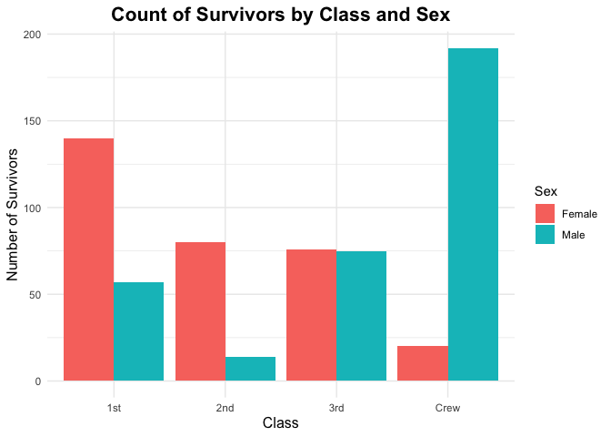
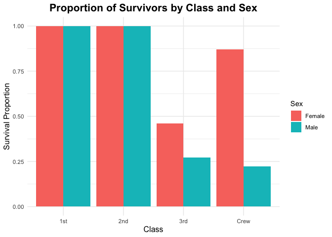
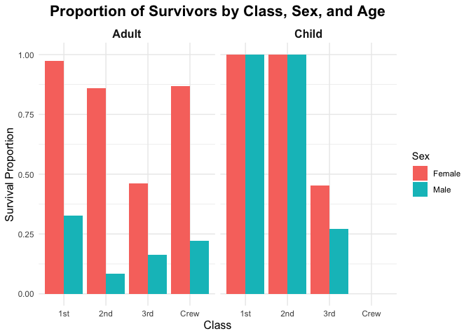

RMS Titanic
================
Sparsh Gupta
2025-01-30

- [Grading Rubric](#grading-rubric)
  - [Individual](#individual)
  - [Submission](#submission)
- [First Look](#first-look)
  - [**q1** Perform a glimpse of `df_titanic`. What variables are in
    this
    dataset?](#q1-perform-a-glimpse-of-df_titanic-what-variables-are-in-this-dataset)
  - [**q2** Skim the Wikipedia article on the RMS Titanic, and look for
    a total count of souls aboard. Compare against the total computed
    below. Are there any differences? Are those differences large or
    small? What might account for those
    differences?](#q2-skim-the-wikipedia-article-on-the-rms-titanic-and-look-for-a-total-count-of-souls-aboard-compare-against-the-total-computed-below-are-there-any-differences-are-those-differences-large-or-small-what-might-account-for-those-differences)
  - [**q3** Create a plot showing the count of persons who *did*
    survive, along with aesthetics for `Class` and `Sex`. Document your
    observations
    below.](#q3-create-a-plot-showing-the-count-of-persons-who-did-survive-along-with-aesthetics-for-class-and-sex-document-your-observations-below)
- [Deeper Look](#deeper-look)
  - [**q4** Replicate your visual from q3, but display `Prop` in place
    of `n`. Document your observations, and note any new/different
    observations you make in comparison with q3. Is there anything
    *fishy* in your
    plot?](#q4-replicate-your-visual-from-q3-but-display-prop-in-place-of-n-document-your-observations-and-note-any-newdifferent-observations-you-make-in-comparison-with-q3-is-there-anything-fishy-in-your-plot)
  - [**q5** Create a plot showing the group-proportion of occupants who
    *did* survive, along with aesthetics for `Class`, `Sex`, *and*
    `Age`. Document your observations
    below.](#q5-create-a-plot-showing-the-group-proportion-of-occupants-who-did-survive-along-with-aesthetics-for-class-sex-and-age-document-your-observations-below)
- [Notes](#notes)

*Purpose*: Most datasets have at least a few variables. Part of our task
in analyzing a dataset is to understand trends as they vary across these
different variables. Unless we’re careful and thorough, we can easily
miss these patterns. In this challenge you’ll analyze a dataset with a
small number of categorical variables and try to find differences among
the groups.

*Reading*: (Optional) [Wikipedia
article](https://en.wikipedia.org/wiki/RMS_Titanic) on the RMS Titanic.

<!-- include-rubric -->

# Grading Rubric

<!-- -------------------------------------------------- -->

Unlike exercises, **challenges will be graded**. The following rubrics
define how you will be graded, both on an individual and team basis.

## Individual

<!-- ------------------------- -->

| Category | Needs Improvement | Satisfactory |
|----|----|----|
| Effort | Some task **q**’s left unattempted | All task **q**’s attempted |
| Observed | Did not document observations, or observations incorrect | Documented correct observations based on analysis |
| Supported | Some observations not clearly supported by analysis | All observations clearly supported by analysis (table, graph, etc.) |
| Assessed | Observations include claims not supported by the data, or reflect a level of certainty not warranted by the data | Observations are appropriately qualified by the quality & relevance of the data and (in)conclusiveness of the support |
| Specified | Uses the phrase “more data are necessary” without clarification | Any statement that “more data are necessary” specifies which *specific* data are needed to answer what *specific* question |
| Code Styled | Violations of the [style guide](https://style.tidyverse.org/) hinder readability | Code sufficiently close to the [style guide](https://style.tidyverse.org/) |

## Submission

<!-- ------------------------- -->

Make sure to commit both the challenge report (`report.md` file) and
supporting files (`report_files/` folder) when you are done! Then submit
a link to Canvas. **Your Challenge submission is not complete without
all files uploaded to GitHub.**

``` r
library(tidyverse)
```

    ## ── Attaching core tidyverse packages ──────────────────────── tidyverse 2.0.0 ──
    ## ✔ dplyr     1.1.4     ✔ readr     2.1.5
    ## ✔ forcats   1.0.0     ✔ stringr   1.5.1
    ## ✔ ggplot2   3.5.1     ✔ tibble    3.2.1
    ## ✔ lubridate 1.9.4     ✔ tidyr     1.3.1
    ## ✔ purrr     1.0.2     
    ## ── Conflicts ────────────────────────────────────────── tidyverse_conflicts() ──
    ## ✖ dplyr::filter() masks stats::filter()
    ## ✖ dplyr::lag()    masks stats::lag()
    ## ℹ Use the conflicted package (<http://conflicted.r-lib.org/>) to force all conflicts to become errors

``` r
df_titanic <- as_tibble(Titanic)
```

*Background*: The RMS Titanic sank on its maiden voyage in 1912; about
67% of its passengers died.

# First Look

<!-- -------------------------------------------------- -->

### **q1** Perform a glimpse of `df_titanic`. What variables are in this dataset?

``` r
## TASK: Perform a `glimpse` of df_titanic
glimpse(df_titanic)
```

    ## Rows: 32
    ## Columns: 5
    ## $ Class    <chr> "1st", "2nd", "3rd", "Crew", "1st", "2nd", "3rd", "Crew", "1s…
    ## $ Sex      <chr> "Male", "Male", "Male", "Male", "Female", "Female", "Female",…
    ## $ Age      <chr> "Child", "Child", "Child", "Child", "Child", "Child", "Child"…
    ## $ Survived <chr> "No", "No", "No", "No", "No", "No", "No", "No", "No", "No", "…
    ## $ n        <dbl> 0, 0, 35, 0, 0, 0, 17, 0, 118, 154, 387, 670, 4, 13, 89, 3, 5…

**Observations**:

- Class: This represents the class the passengers were traveling in.
- Sex: This represents the sex of the individuals. (“Male” or “Female”).
- Age: This represents the age of the observations.
- Survived: This represents if the observation survived the accident or
  not. (“Yes” if survived, otherwise “No”).
- n: This number represents the number of individuals in that specific
  observation category.

### **q2** Skim the [Wikipedia article](https://en.wikipedia.org/wiki/RMS_Titanic) on the RMS Titanic, and look for a total count of souls aboard. Compare against the total computed below. Are there any differences? Are those differences large or small? What might account for those differences?

``` r
## NOTE: No need to edit! We'll cover how to
## do this calculation in a later exercise.
df_titanic %>% summarize(total = sum(n))
```

    ## # A tibble: 1 × 1
    ##   total
    ##   <dbl>
    ## 1  2201

**Observations**:

- From the R code above, the total number of souls aboard the RMS
  Titanic is 2201. This value represents the sum of all recorded
  individuals in the dataset.
- According to Wikipedia, the total number of people aboard the Titanic
  was 2224.
- Are there any differences?
  - There is a difference of 23 individuals between the calculated
    dataset total (2201) and the Wikipedia source (2224).
  - The difference (23 individuals) represents approximately 1.03% of
    the total, which is relatively small when compared to the number of
    souls aboard.
- If yes, what might account for those differences?
  - The dataset used for the computation might not account for every
    individual aboard. One possible things that could cause this are
    crew members or passengers that boarded the Titanic after the ticket
    records were finalized. Another possible cause might be unofficial
    passengers aboard who were not registered.
  - Titanic’s records were created over 100 years ago, and therefore,
    slight inconsistencies between data records are not uncommon.
  - There is a possibility that certain rows or individuals may have
    been omitted during preprocessing of data, for reasons such as
    incomplete data for some observations.
  - There might be errors in defining who was considered “aboard”
    because it might not account for crew members whose roles were
    clearly less documented (e.g. temporary hires, etc.)
  - The Titanic also made some port stops on the trip before the
    accident happened, where it picked up passengers and dropped some
    passengers off. This means that the number of passengers aboard the
    Titanic fluctuated and so maintaining a definite count of people
    aboard might not have been possible.

### **q3** Create a plot showing the count of persons who *did* survive, along with aesthetics for `Class` and `Sex`. Document your observations below.

*Note*: There are many ways to do this.

``` r
## TASK: Visualize counts against `Class` and `Sex`
df_titanic %>%
  filter(Survived == "Yes") %>%
  ggplot(aes(Class, n, fill = Sex)) +
  geom_bar(stat = "identity", position = "dodge") +
  labs(
    title = "Count of Survivors by Class and Sex",
    x = "Class",
    y = "Number of Survivors",
    fill = "Sex"
  ) +
  theme_minimal() +
  theme(
    plot.title = element_text(size = 16, face = "bold", hjust = 0.5),
    axis.title.x = element_text(size = 12),
    axis.title.y = element_text(size = 12),
    strip.text = element_text(size = 12, face = "bold")
  )
```

<!-- -->

**Observations**:

- The bar plot represents the count of survivors grouped by “Class”
  (1st, 2nd, 3rd, Crew) and divided by “Sex” (Male, Female). Each
  “Class” has separate bars for males and females to compare survival
  counts.
- Class-wise Observations:
  - 1st Class: Female survivors significantly outnumber male survivors.
    This suggests strong prioritization of women in lifeboats for this
    class, possibly due to social norms or accessibility advantages.
  - 2nd Class: Female survivors are higher than male survivors, but the
    difference is not as large as in 1st class. This indicates that
    while women were prioritized, the survival advantage for females was
    lower than in 1st class.
  - 3rd Class: Male and female survivors appear almost equal in number.
    This contrasts with the common expectation that females had a higher
    survival rate, suggesting barriers to lifeboat access for women in
    3rd class.
  - Crew: Male survivors overwhelmingly outnumber female survivors. This
    likely reflects the fact that the Titanic crew had significantly
    more men than women (to explore this further, we need to look at the
    number of males vs females in the crew). Another possible reason is
    that male crew members may have had better access to lifeboats.
- Females had higher survival rates in 1st and 2nd class, which is
  probably because of social norms in higher classes where saving women
  and children first was the priority.
- In 3rd class, survival rates between males and females are more
  balanced, possibly due to difficulties accessing lifeboats.
- Overall, the data suggests a class-based and gender-based disparity in
  survival, with higher-class passengers having better survival chances.

# Deeper Look

<!-- -------------------------------------------------- -->

Raw counts give us a sense of totals, but they are not as useful for
understanding differences between groups. This is because the
differences we see in counts could be due to either the relative size of
the group OR differences in outcomes for those groups. To make
comparisons between groups, we should also consider *proportions*.\[1\]

The following code computes proportions within each `Class, Sex, Age`
group.

``` r
## NOTE: No need to edit! We'll cover how to
## do this calculation in a later exercise.
df_prop <-
  df_titanic %>%
  group_by(Class, Sex, Age) %>%
  mutate(
    Total = sum(n),
    Prop = n / Total
  ) %>%
  ungroup()
df_prop
```

    ## # A tibble: 32 × 7
    ##    Class Sex    Age   Survived     n Total    Prop
    ##    <chr> <chr>  <chr> <chr>    <dbl> <dbl>   <dbl>
    ##  1 1st   Male   Child No           0     5   0    
    ##  2 2nd   Male   Child No           0    11   0    
    ##  3 3rd   Male   Child No          35    48   0.729
    ##  4 Crew  Male   Child No           0     0 NaN    
    ##  5 1st   Female Child No           0     1   0    
    ##  6 2nd   Female Child No           0    13   0    
    ##  7 3rd   Female Child No          17    31   0.548
    ##  8 Crew  Female Child No           0     0 NaN    
    ##  9 1st   Male   Adult No         118   175   0.674
    ## 10 2nd   Male   Adult No         154   168   0.917
    ## # ℹ 22 more rows

### **q4** Replicate your visual from q3, but display `Prop` in place of `n`. Document your observations, and note any new/different observations you make in comparison with q3. Is there anything *fishy* in your plot?

``` r
df_prop %>%
  filter(Survived == "Yes") %>%
  ggplot(aes(Class, Prop, fill = Sex)) +
  geom_bar(stat = "identity", position = "dodge", na.rm = TRUE) +
  labs(
    title = "Proportion of Survivors by Class and Sex",
    x = "Class",
    y = "Survival Proportion",
    fill = "Sex"
  ) +
  theme_minimal() +
  theme(
    plot.title = element_text(size = 16, face = "bold", hjust = 0.5),
    axis.title.x = element_text(size = 12),
    axis.title.y = element_text(size = 12),
    strip.text = element_text(size = 12, face = "bold")
  )
```

<!-- -->

**Observations**:

- The bar plot represents the proportion of passengers categorized by
  Class (1st, 2nd, 3rd, Crew) and divided by Sex (Male, Female).
- Class-wise Observations:
  - 1st Class: The survival proportion is 1.0 for both males and
    females, meaning all recorded survivors from this class survived at
    the same rate. This differs from the q3 plot, where the absolute
    count of surviving females was higher.
  - 2nd Class: Again, both males and females have a survival proportion
    of 1.0, meaning all survivors from this class, regardless of sex,
    had the same survival rate.
  - 3rd Class: Females have a higher survival proportion than males,
    meaning a larger fraction of female passengers in this class
    survived compared to males. However, unlike 1st and 2nd class, the
    survival proportion is significantly lower than 1.0, showing that
    many 3rd-class passengers did not survive.
  - Crew: The female crew members have a much higher survival proportion
    than male crew members. This trend was already visible in q3, but
    now it’s clearer that the survival chance for male crew members was
    very low.
- Comparison with q3:
  - 1st and 2nd class: In q3, female survivors outnumbered male
    survivors in absolute numbers. However, in this plot, the
    proportions are equal (1.0), which might be discrepancy.
  - 3rd class: In q3, the number of male and female survivors looked
    somewhat balanced, but this plot shows that the survival rate for
    males in 3rd class was much lower than for females. This suggests a
    much lower survival rate for males in this class, possibly due to
    restricted lifeboat access.
  - Crew: In the q3 plot, the number of male survivors was significantly
    higher than the number of female survivors. However, in this plot,
    the survival proportion of female crew members is significantly
    higher than male crew members. This signifies that most female crew
    numbers who were less in number were able to survive unlike the male
    crew members which outnumbered the female crew members but most of
    them were not able to survive.
- Is there anything *fishy* going on in your plot?
  - Yes, there might be some discrepancies with the crew data.
  - 1st & 2nd Class Proportions Being 1.0: This suggests that all
    recorded individuals in these groups survived, which is historically
    inaccurate. There were non-survivors in both classes, so this could
    indicate a data filtering error or incorrect proportion
    calculations.

### **q5** Create a plot showing the group-proportion of occupants who *did* survive, along with aesthetics for `Class`, `Sex`, *and* `Age`. Document your observations below.

*Hint*: Don’t forget that you can use `facet_grid` to help consider
additional variables!

``` r
ggplot(data = df_prop %>% filter(Survived == "Yes"), aes(x = Class, y = Prop, fill = Sex)) +
  geom_bar(stat = "identity", position = "dodge", na.rm = TRUE) +
  facet_grid(~Age) +
  labs(
    title = "Proportion of Survivors by Class, Sex, and Age",
    x = "Class",
    y = "Survival Proportion",
    fill = "Sex"
  ) +
  theme_minimal() +
  theme(
    plot.title = element_text(size = 16, face = "bold", hjust = 0.5),
    axis.title.x = element_text(size = 12),
    axis.title.y = element_text(size = 12),
    strip.text = element_text(size = 12, face = "bold")
  )
```

<!-- -->

**Observations**:

- The bar plot represents the proportion of survivors, categorized by
  Class (1st, 2nd, 3rd, Crew) and further divided by Age group (Adult,
  Child) and Sex (Male, Female).
- Observations for Adults:
  - 1st class adult females had the highest survival rate (~95%), while
    2nd class adult males had the lowest survival proportion (~10%) out
    of all the categories.
  - Females had a higher survival rate in all the classes when compared
    to the adult males who had significantly lower survival rates. This
    indicates that females were prioritized to get on the lifeboats
    first after the accident.
  - 1st-class adults had the best survival rate, likely due to better
    access to lifeboats.
  - 3rd-class adults had the lowest survival proportions, reflecting
    that lower-class passengers had limited access to lifeboats.
  - Crew adult females had a significantly higher survival rate compared
    to the crew adult males, whose survival rate was quite low.
- Observations for Children:
  - Survival proportions for children in 1st and 2nd class were 100% for
    both male and female children, meaning every child in these classes
    survived and both these groups had the best survival rates out of
    all the proportion groups.
  - 3rd class children had significantly lower survival rates when
    compared to the other classes, and specifically, male children had
    lower survival rates than female children. This is probably because
    3rd class children did not have an equitable access to the lifeboats
    when compared to 1st and 2nd class children.
- If you saw something *fishy* in q4 above, use your new plot to explain
  the fishy-ness.
  - I think the fishy-ness was caused because the proportions of adult
    survivors were being shadowed over by the data for the proportions
    of child survivors. So, for the 1st, 2nd, and 3rd classes, the data
    in the plot in q4 represented only the survival proportions for the
    children and not the adults. Since there was no children in the
    crew, the plot in q4 correctly represented the survival proportions
    for this class. Dividing the data by Age group (Adult, Child)
    enabled to resolve this fishy-ness because now we can see the data
    separately and the children data is not overlapping the adults data.

# Notes

<!-- -------------------------------------------------- -->

\[1\] This is basically the same idea as [Dimensional
Analysis](https://en.wikipedia.org/wiki/Dimensional_analysis); computing
proportions is akin to non-dimensionalizing a quantity.
