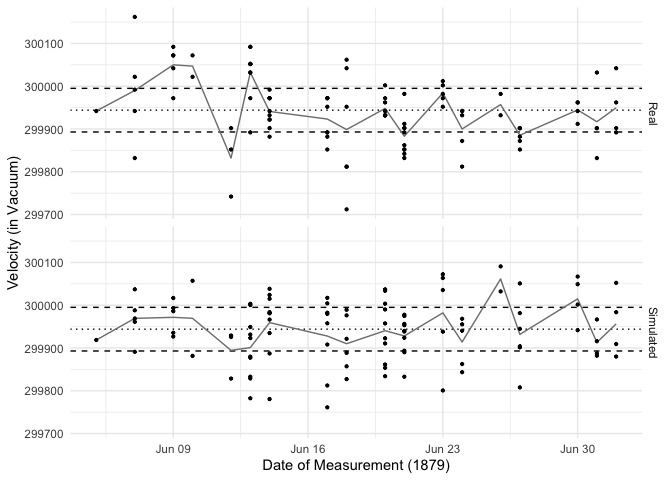
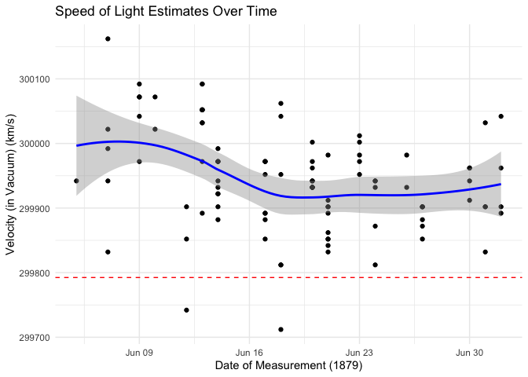
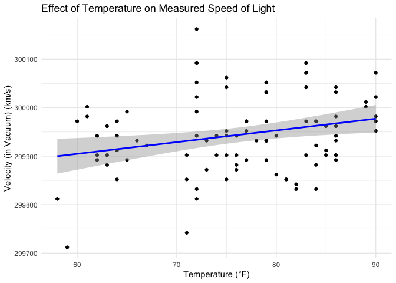
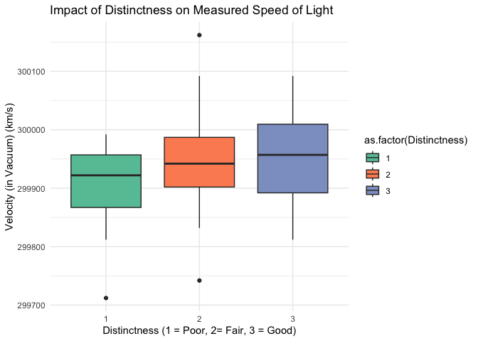

Michelson Speed-of-light Measurements
================
Sparsh Gupta
2025-02-02

- [Grading Rubric](#grading-rubric)
  - [Individual](#individual)
  - [Submission](#submission)
    - [**q1** Re-create the following table (from Michelson (1880),
      pg. 139) using `df_michelson` and `dplyr`. Note that your values
      *will not* match those of Michelson *exactly*; why might this
      be?](#q1-re-create-the-following-table-from-michelson-1880-pg-139-using-df_michelson-and-dplyr-note-that-your-values-will-not-match-those-of-michelson-exactly-why-might-this-be)
    - [**q2** Create a new variable `VelocityVacuum` with the $+92$ km/s
      adjustment to `Velocity`. Assign this new dataframe to
      `df_q2`.](#q2-create-a-new-variable-velocityvacuum-with-the-92-kms-adjustment-to-velocity-assign-this-new-dataframe-to-df_q2)
    - [**q3** Compare Michelson’s speed of light estimate against the
      modern speed of light value. Is Michelson’s estimate of the error
      (his uncertainty) greater or less than the true
      error?](#q3-compare-michelsons-speed-of-light-estimate-against-the-modern-speed-of-light-value-is-michelsons-estimate-of-the-error-his-uncertainty-greater-or-less-than-the-true-error)
    - [**q4** Inspect the following plot with the `Real` Michelson data
      and `Simulated` data from a probability model. Document the
      similarities and differences between the data under *observe*
      below.](#q4-inspect-the-following-plot-with-the-real-michelson-data-and-simulated-data-from-a-probability-model-document-the-similarities-and-differences-between-the-data-under-observe-below)
    - [**q5** You have access to a few other variables. Construct a **at
      least three** visualizations of `VelocityVacuum` against these
      other factors. Are there other patterns in the data that might
      help explain the difference between Michelson’s estimate and
      `LIGHTSPEED_VACUUM`?](#q5-you-have-access-to-a-few-other-variables-construct-a-at-least-three-visualizations-of-velocityvacuum-against-these-other-factors-are-there-other-patterns-in-the-data-that-might-help-explain-the-difference-between-michelsons-estimate-and-lightspeed_vacuum)
  - [Bibliography](#bibliography)

*Purpose*: When studying physical problems, there is an important
distinction between *error* and *uncertainty*. The primary purpose of
this challenge is to dip our toes into these factors by analyzing a real
dataset.

*Reading*: [Experimental Determination of the Velocity of
Light](https://play.google.com/books/reader?id=343nAAAAMAAJ&hl=en&pg=GBS.PA115)
(Optional)

<!-- include-rubric -->

# Grading Rubric

<!-- -------------------------------------------------- -->

Unlike exercises, **challenges will be graded**. The following rubrics
define how you will be graded, both on an individual and team basis.

## Individual

<!-- ------------------------- -->

| Category | Needs Improvement | Satisfactory |
|----|----|----|
| Effort | Some task **q**’s left unattempted | All task **q**’s attempted |
| Observed | Did not document observations, or observations incorrect | Documented correct observations based on analysis |
| Supported | Some observations not clearly supported by analysis | All observations clearly supported by analysis (table, graph, etc.) |
| Assessed | Observations include claims not supported by the data, or reflect a level of certainty not warranted by the data | Observations are appropriately qualified by the quality & relevance of the data and (in)conclusiveness of the support |
| Specified | Uses the phrase “more data are necessary” without clarification | Any statement that “more data are necessary” specifies which *specific* data are needed to answer what *specific* question |
| Code Styled | Violations of the [style guide](https://style.tidyverse.org/) hinder readability | Code sufficiently close to the [style guide](https://style.tidyverse.org/) |

## Submission

<!-- ------------------------- -->

Make sure to commit both the challenge report (`report.md` file) and
supporting files (`report_files/` folder) when you are done! Then submit
a link to Canvas. **Your Challenge submission is not complete without
all files uploaded to GitHub.**

``` r
# Libraries
library(tidyverse)
library(googlesheets4)

url <- "https://docs.google.com/spreadsheets/d/1av_SXn4j0-4Rk0mQFik3LLr-uf0YdA06i3ugE6n-Zdo/edit?usp=sharing"

# Parameters
LIGHTSPEED_VACUUM    <- 299792.458 # Exact speed of light in a vacuum (km / s)
LIGHTSPEED_MICHELSON <- 299944.00  # Michelson's speed estimate (km / s)
LIGHTSPEED_PM        <- 51         # Michelson error estimate (km / s)
```

*Background*: In 1879 Albert Michelson led an experimental campaign to
measure the speed of light. His approach was a development upon the
method of Foucault\[3\], and resulted in a new estimate of
$v_0 = 299944 \pm 51$ kilometers per second (in a vacuum). This is very
close to the modern *exact* value of 2.9979246^{5}. In this challenge,
you will analyze Michelson’s original data, and explore some of the
factors associated with his experiment.

I’ve already copied Michelson’s data from his 1880 publication; the code
chunk below will load these data from a public googlesheet.

*Aside*: The speed of light is *exact* (there is **zero error** in the
value `LIGHTSPEED_VACUUM`) because the meter is actually
[*defined*](https://en.wikipedia.org/wiki/Metre#Speed_of_light_definition)
in terms of the speed of light!

``` r
## Note: No need to edit this chunk!
gs4_deauth()
ss <- gs4_get(url)
df_michelson <-
  read_sheet(ss) %>%
  select(Date, Distinctness, Temp, Velocity) %>%
  mutate(Distinctness = as_factor(Distinctness))
```

    ## ✔ Reading from "michelson1879".

    ## ✔ Range 'Sheet1'.

``` r
df_michelson %>% glimpse()
```

    ## Rows: 100
    ## Columns: 4
    ## $ Date         <dttm> 1879-06-05, 1879-06-07, 1879-06-07, 1879-06-07, 1879-06-…
    ## $ Distinctness <fct> 3, 2, 2, 2, 2, 2, 3, 3, 3, 3, 2, 2, 2, 2, 2, 1, 3, 3, 2, …
    ## $ Temp         <dbl> 76, 72, 72, 72, 72, 72, 83, 83, 83, 83, 83, 90, 90, 71, 7…
    ## $ Velocity     <dbl> 299850, 299740, 299900, 300070, 299930, 299850, 299950, 2…

*Data dictionary*:

- `Date`: Date of measurement
- `Distinctness`: Distinctness of measured images: 3 = good, 2 = fair, 1
  = poor
- `Temp`: Ambient temperature (Fahrenheit)
- `Velocity`: Measured speed of light (km / s)

### **q1** Re-create the following table (from Michelson (1880), pg. 139) using `df_michelson` and `dplyr`. Note that your values *will not* match those of Michelson *exactly*; why might this be?

| Distinctness | n   | MeanVelocity |
|--------------|-----|--------------|
| 3            | 46  | 299860       |
| 2            | 39  | 299860       |
| 1            | 15  | 299810       |

``` r
## Compute summaries
df_q1 <- df_michelson %>%
  group_by(Distinctness) %>% 
  summarize(n = n(), MeanVelocity = round(mean(Velocity)))

df_q1 %>%
  arrange(desc(Distinctness)) %>%
  knitr::kable()
```

| Distinctness |   n | MeanVelocity |
|:-------------|----:|-------------:|
| 3            |  46 |       299862 |
| 2            |  39 |       299858 |
| 1            |  15 |       299808 |

**Observations**:

- The mean velocity values for each distinctness category are close to
  michelson’s reported values but not exactly the same, having an error
  of +/-2 in this table.

- The values for `MeanVelocity` differ slightly across distinctness
  levels, indicating that measurement clarity (Distinctness) may have
  influenced the recorded speed.

- That standard deviation within each category could provide further
  insights into measurement variability.

**Possible hypothesis for the discrepancy between our table and
Michelson’s original table:**

- Michelson may have excluded certain measurements due to experimental
  conditions or errors that were not recorded in our dataset.

- Michelson may have applied different rounding conventions when
  computing the mean velocity, leading to slight variations.

- If the data was transcribed manually from Michelson’s publication,
  there could be small errors in recorded values.

The `Velocity` values in the dataset are the speed of light *in air*;
Michelson introduced a couple of adjustments to estimate the speed of
light in a vacuum. In total, he added $+92$ km/s to his mean estimate
for `VelocityVacuum` (from Michelson (1880), pg. 141). While the
following isn’t fully rigorous ($+92$ km/s is based on the mean
temperature), we’ll simply apply this correction to all the observations
in the dataset.

### **q2** Create a new variable `VelocityVacuum` with the $+92$ km/s adjustment to `Velocity`. Assign this new dataframe to `df_q2`.

``` r
## Adjust the data, assign to df_q2
df_q2 <- df_michelson %>% 
  mutate(VelocityVacuum = Velocity + 92)

df_q2
```

    ## # A tibble: 100 × 5
    ##    Date                Distinctness  Temp Velocity VelocityVacuum
    ##    <dttm>              <fct>        <dbl>    <dbl>          <dbl>
    ##  1 1879-06-05 00:00:00 3               76   299850         299942
    ##  2 1879-06-07 00:00:00 2               72   299740         299832
    ##  3 1879-06-07 00:00:00 2               72   299900         299992
    ##  4 1879-06-07 00:00:00 2               72   300070         300162
    ##  5 1879-06-07 00:00:00 2               72   299930         300022
    ##  6 1879-06-07 00:00:00 2               72   299850         299942
    ##  7 1879-06-09 00:00:00 3               83   299950         300042
    ##  8 1879-06-09 00:00:00 3               83   299980         300072
    ##  9 1879-06-09 00:00:00 3               83   299980         300072
    ## 10 1879-06-09 00:00:00 3               83   299880         299972
    ## # ℹ 90 more rows

As part of his study, Michelson assessed the various potential sources
of error, and provided his best-guess for the error in his
speed-of-light estimate. These values are provided in
`LIGHTSPEED_MICHELSON`—his nominal estimate—and
`LIGHTSPEED_PM`—plus/minus bounds on his estimate. Put differently,
Michelson believed the true value of the speed-of-light probably lay
between `LIGHTSPEED_MICHELSON - LIGHTSPEED_PM` and
`LIGHTSPEED_MICHELSON + LIGHTSPEED_PM`.

Let’s introduce some terminology:\[2\]

- **Error** is the difference between a true value and an estimate of
  that value; for instance `LIGHTSPEED_VACUUM - LIGHTSPEED_MICHELSON`.
- **Uncertainty** is an analyst’s *assessment* of the error.

Since a “true” value is often not known in practice, one generally does
not know the error. The best they can do is quantify their degree of
uncertainty. We will learn some means of quantifying uncertainty in this
class, but for many real problems uncertainty includes some amount of
human judgment.\[2\]

### **q3** Compare Michelson’s speed of light estimate against the modern speed of light value. Is Michelson’s estimate of the error (his uncertainty) greater or less than the true error?

``` r
## Compare Michelson's estimate and error against the true value
error <- LIGHTSPEED_VACUUM - LIGHTSPEED_MICHELSON
uncertainty_lower <- LIGHTSPEED_MICHELSON - LIGHTSPEED_PM
uncertainty_upper <- LIGHTSPEED_MICHELSON + LIGHTSPEED_PM

error
```

    ## [1] -151.542

``` r
uncertainty_lower
```

    ## [1] 299893

``` r
uncertainty_upper
```

    ## [1] 299995

**Observations**:

\- Is Michelson’s estimate of the error (his uncertainty) greater or
less than the true error?

- Michelson’s uncertainty range is \[299893 km/s, 299995 km/s\], whereas
  the true value of the speed of light is 299792.458 km/s.

- The true error is -151.542 km/s. Thus, Michelson overestimated the
  speed of light.

- Since Michelson’s uncertainty range does not contain the true value
  (299792.458 km/s), his estimated uncertainty is less than the true
  error.

\- Make a quantitative comparison between Michelson’s uncertainty and
his error.

- Michelson’s estimated uncertainty is +/-51 km/s, meaning he believed
  the true value was within 51 km/s off his estimate.

- However, the actual error is -151.542 km/s, which is almost three
  times larger than Michelson’s estimated uncertainty.

- This suggests that Michelson underestimated the potential error in his
  experiments, possibly due to unknown systematic errors or unaccounted
  environmental factors.

The following plot shows all of Michelson’s data as a [control
chart](https://en.wikipedia.org/wiki/Control_chart); this sort of plot
is common in manufacturing, where it is used to help determine if a
manufacturing process is under [statistical
control](https://en.wikipedia.org/wiki/Statistical_process_control).
Each dot is one of Michelson’s measurements, and the grey line connects
the mean taken for each day. The same plot also shows simulated data
using a probability model. We’ll get into statistics later in the
course; for now, let’s focus on understanding what real and simulated
data tend to look like.

### **q4** Inspect the following plot with the `Real` Michelson data and `Simulated` data from a probability model. Document the similarities and differences between the data under *observe* below.

``` r
## Note: No need to edit this chunk!
## Calibrate simulated data
v_mean <-
  df_q2 %>%
  summarize(m = mean(VelocityVacuum)) %>%
  pull(m)
v_sd <-
  df_q2 %>%
  summarize(s = sd(VelocityVacuum)) %>%
  pull(s)

## Visualize
set.seed(101)
df_q2 %>%
  mutate(Simulated = rnorm(n(), mean = v_mean, sd = v_sd)) %>%
  rename(Real = VelocityVacuum) %>%
  pivot_longer(
    cols = c(Simulated, Real),
    names_to = "source",
    values_to = "velocity"
  ) %>%

  ggplot(aes(Date, velocity)) +
  geom_hline(
    yintercept = LIGHTSPEED_MICHELSON,
    linetype = "dotted"
  ) +
  geom_hline(
    yintercept = LIGHTSPEED_MICHELSON - LIGHTSPEED_PM,
    linetype = "dashed"
  ) +
  geom_hline(
    yintercept = LIGHTSPEED_MICHELSON + LIGHTSPEED_PM,
    linetype = "dashed"
  ) +

  geom_line(
    data = . %>%
      group_by(Date, source) %>%
      summarize(velocity_mean = mean(velocity)),
    mapping = aes(y = velocity_mean),
    color = "grey50"
  ) +
  geom_point(
    mapping = aes(y = velocity),
    size = 0.8
  ) +

  facet_grid(source~.) +
  theme_minimal() +
  labs(
    x = "Date of Measurement (1879)",
    y = "Velocity (in Vacuum)"
  )
```

    ## `summarise()` has grouped output by 'Date'. You can override using the
    ## `.groups` argument.

<!-- -->

**Observations**:

Similarities:

- General Trend: Both real and simulated data exhibit a similar overall
  structure, with most daily mean values (grey lines) fluctuating within
  a defined range of Michelson’s uncertainty bounds
  (`LIGHTSPEED_MICHELSON +/- LIGHTSPEED_PM`).

- Spread of data points: The individual measurements (dots) in both
  cases appear scattered around a central value.

Differences:

- Real data has more extreme outliers: The real dataset contains
  occasional extreme values significantly deviating from the mean,
  whereas the simulated data is more tightly distributed around its
  mean. This suggests that Michelson’s experiment had additional sources
  of error not captured by a simple probabilistic model.

- Variation in daily means: The real data shows larger fluctuations in
  the daily mean compared to the simulated data, indicating that
  measuremement conditions (e.g., temperature, instrument precision)
  likely influenced real-world results.

- Clustering in real data: Some days in the real dataset have clusters
  of points more tightly packed than expected under a normal
  distribution, suggesting non-random effects such as systematic biases
  or environmental factors.

### **q5** You have access to a few other variables. Construct a **at least three** visualizations of `VelocityVacuum` against these other factors. Are there other patterns in the data that might help explain the difference between Michelson’s estimate and `LIGHTSPEED_VACUUM`?

``` r
df_q2 %>%
  ggplot(aes(Date, VelocityVacuum)) +
  geom_point() +
  geom_smooth(method = "loess", color = "blue") +
  geom_hline(yintercept = LIGHTSPEED_VACUUM, linetype = "dashed", color = "red") +
  theme_minimal() +
  labs(
    title = "Speed of Light Estimates Over Time",
    x = "Date of Measurement (1879)",
    y = "Velocity (in Vacuum) (km/s)"
  )
```

    ## `geom_smooth()` using formula = 'y ~ x'

<!-- -->

**Observations**:

- The individual data points show fluctuations in the Velocity (in
  Vacuum) over the measurement period.
- The blue line (LOESS smoother) suggests a slight downward trend in
  measured velocity around mid-June after stabilizing.
- The red dashed line represents `LIGHTSPEED_VACUUM` (299792.458 km/s),
  showing that Michelson’s estimates were generally higher than the true
  value.
- The variation over time may indicate systematic errors related to
  measurement conditions, observer bias, etc. rather than purely random
  noise. On possible explanation could also be related to the
  calibration of equipment in the initial stages of measurement, where
  the error was considerably larger compared to when the measured
  velocity data started to stabilize, which probably took time due to
  tuning of the equipment after obtaining initial data.

``` r
df_q2 %>%
  ggplot(aes(Temp, VelocityVacuum)) +
  geom_point() +
  geom_smooth(method = "lm", color = "blue", se = TRUE) +
  theme_minimal() +
  labs(
    title = "Effect of Temperature on Measured Speed of Light",
    x = "Temperature (°F)",
    y = "Velocity (in Vacuum) (km/s)"
  )
```

    ## `geom_smooth()` using formula = 'y ~ x'

<!-- -->

**Observations**:

- While the regression line suggests a slight positive correlation
  between velocity (in vacuum) and temperature, the data points exhibit
  a high degree of scatter. This suggests that any relationship between
  temperature and measured velocity most probably does not, and is very
  weak if it exists at all.

- Higher temperatures appear to be associated with higher measured
  velocities.

- A possible explanation for this could include thermal expansion of
  experimental equipment that could have affected measurements. Another
  explanation might be that the refraction index of air changes with
  temperature, which could have impacted speed calculations.

``` r
df_q2 %>%
  ggplot(aes(as.factor(Distinctness), VelocityVacuum, fill = as.factor(Distinctness))) +
  geom_boxplot() +
  theme_minimal() +
  labs(
    title = "Impact of Distinctness on Measured Speed of Light",
    x = "Distinctness (1 = Poor, 2= Fair, 3 = Good)",
    y = "Velocity (in Vacuum) (km/s)"
  ) +
  scale_fill_brewer(palette = "Set2")
```

<!-- -->

**Observations**:

- From this box plot, we notice that while the median vacuum velocity
  appears slightly higher for Distinctness 3 (Good) compared to
  Distinctness 1 (Poor) and 2 (Fair), the substantial overlap between
  the boxplots suggests that this trend is weak and may not be
  statistically significant. 

- Distinctness 1 (Poor) has a lower minimum value for its interquartile
  range, suggesting that poor-quality measurements occasionally led to
  underestimated values.

- A few outliers appear for Distinctness 1 (Poor) and 2 (Fair),
  indicating that measurements with worse quality than Distinctness 3
  (Good) yielded random fluctuations or experimental inconsistencies.

## Bibliography

- \[1\] Michelson, [Experimental Determination of the Velocity of
  Light](https://play.google.com/books/reader?id=343nAAAAMAAJ&hl=en&pg=GBS.PA115)
  (1880)
- \[2\] Henrion and Fischhoff, [Assessing Uncertainty in Physical
  Constants](https://www.cmu.edu/epp/people/faculty/research/Fischoff-Henrion-Assessing%20uncertainty%20in%20physical%20constants.pdf)
  (1986)
- \[3\] BYU video about a [Fizeau-Foucault
  apparatus](https://www.youtube.com/watch?v=Ik5ORaaeaME), similar to
  what Michelson used.
