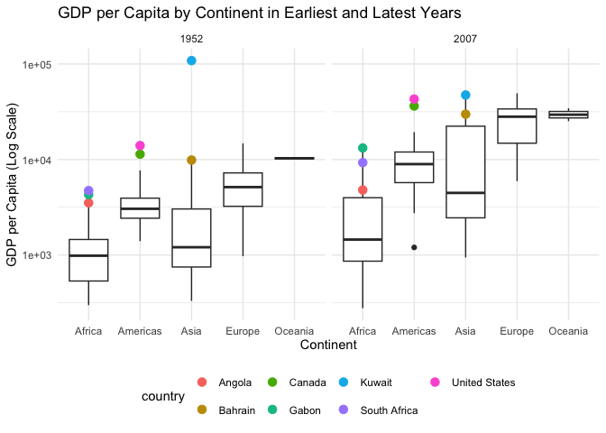

Gapminder
================
Sparsh Gupta
2025-02-25

- [Grading Rubric](#grading-rubric)
  - [Individual](#individual)
  - [Submission](#submission)
- [Guided EDA](#guided-eda)
  - [**q0** Perform your “first checks” on the dataset. What variables
    are in this
    dataset?](#q0-perform-your-first-checks-on-the-dataset-what-variables-are-in-this-dataset)
  - [**q1** Determine the most and least recent years in the `gapminder`
    dataset.](#q1-determine-the-most-and-least-recent-years-in-the-gapminder-dataset)
  - [**q2** Filter on years matching `year_min`, and make a plot of the
    GDP per capita against continent. Choose an appropriate `geom_` to
    visualize the data. What observations can you
    make?](#q2-filter-on-years-matching-year_min-and-make-a-plot-of-the-gdp-per-capita-against-continent-choose-an-appropriate-geom_-to-visualize-the-data-what-observations-can-you-make)
  - [**q3** You should have found *at least* three outliers in q2 (but
    possibly many more!). Identify those outliers (figure out which
    countries they
    are).](#q3-you-should-have-found-at-least-three-outliers-in-q2-but-possibly-many-more-identify-those-outliers-figure-out-which-countries-they-are)
  - [**q4** Create a plot similar to yours from q2 studying both
    `year_min` and `year_max`. Find a way to highlight the outliers from
    q3 on your plot *in a way that lets you identify which country is
    which*. Compare the patterns between `year_min` and
    `year_max`.](#q4-create-a-plot-similar-to-yours-from-q2-studying-both-year_min-and-year_max-find-a-way-to-highlight-the-outliers-from-q3-on-your-plot-in-a-way-that-lets-you-identify-which-country-is-which-compare-the-patterns-between-year_min-and-year_max)
- [Your Own EDA](#your-own-eda)
  - [**q5** Create *at least* three new figures below. With each figure,
    try to pose new questions about the
    data.](#q5-create-at-least-three-new-figures-below-with-each-figure-try-to-pose-new-questions-about-the-data)

*Purpose*: Learning to do EDA well takes practice! In this challenge
you’ll further practice EDA by first completing a guided exploration,
then by conducting your own investigation. This challenge will also give
you a chance to use the wide variety of visual tools we’ve been
learning.

<!-- include-rubric -->

# Grading Rubric

<!-- -------------------------------------------------- -->

Unlike exercises, **challenges will be graded**. The following rubrics
define how you will be graded, both on an individual and team basis.

## Individual

<!-- ------------------------- -->

| Category | Needs Improvement | Satisfactory |
|----|----|----|
| Effort | Some task **q**’s left unattempted | All task **q**’s attempted |
| Observed | Did not document observations, or observations incorrect | Documented correct observations based on analysis |
| Supported | Some observations not clearly supported by analysis | All observations clearly supported by analysis (table, graph, etc.) |
| Assessed | Observations include claims not supported by the data, or reflect a level of certainty not warranted by the data | Observations are appropriately qualified by the quality & relevance of the data and (in)conclusiveness of the support |
| Specified | Uses the phrase “more data are necessary” without clarification | Any statement that “more data are necessary” specifies which *specific* data are needed to answer what *specific* question |
| Code Styled | Violations of the [style guide](https://style.tidyverse.org/) hinder readability | Code sufficiently close to the [style guide](https://style.tidyverse.org/) |

## Submission

<!-- ------------------------- -->

Make sure to commit both the challenge report (`report.md` file) and
supporting files (`report_files/` folder) when you are done! Then submit
a link to Canvas. **Your Challenge submission is not complete without
all files uploaded to GitHub.**

``` r
library(tidyverse)
```

    ## ── Attaching core tidyverse packages ──────────────────────── tidyverse 2.0.0 ──
    ## ✔ dplyr     1.1.4     ✔ readr     2.1.5
    ## ✔ forcats   1.0.0     ✔ stringr   1.5.1
    ## ✔ ggplot2   3.5.1     ✔ tibble    3.2.1
    ## ✔ lubridate 1.9.4     ✔ tidyr     1.3.1
    ## ✔ purrr     1.0.2     
    ## ── Conflicts ────────────────────────────────────────── tidyverse_conflicts() ──
    ## ✖ dplyr::filter() masks stats::filter()
    ## ✖ dplyr::lag()    masks stats::lag()
    ## ℹ Use the conflicted package (<http://conflicted.r-lib.org/>) to force all conflicts to become errors

``` r
library(gapminder)
```

*Background*: [Gapminder](https://www.gapminder.org/about-gapminder/) is
an independent organization that seeks to educate people about the state
of the world. They seek to counteract the worldview constructed by a
hype-driven media cycle, and promote a “fact-based worldview” by
focusing on data. The dataset we’ll study in this challenge is from
Gapminder.

# Guided EDA

<!-- -------------------------------------------------- -->

First, we’ll go through a round of *guided EDA*. Try to pay attention to
the high-level process we’re going through—after this guided round
you’ll be responsible for doing another cycle of EDA on your own!

### **q0** Perform your “first checks” on the dataset. What variables are in this dataset?

``` r
# structure of dataset
str(gapminder)
```

    ## tibble [1,704 × 6] (S3: tbl_df/tbl/data.frame)
    ##  $ country  : Factor w/ 142 levels "Afghanistan",..: 1 1 1 1 1 1 1 1 1 1 ...
    ##  $ continent: Factor w/ 5 levels "Africa","Americas",..: 3 3 3 3 3 3 3 3 3 3 ...
    ##  $ year     : int [1:1704] 1952 1957 1962 1967 1972 1977 1982 1987 1992 1997 ...
    ##  $ lifeExp  : num [1:1704] 28.8 30.3 32 34 36.1 ...
    ##  $ pop      : int [1:1704] 8425333 9240934 10267083 11537966 13079460 14880372 12881816 13867957 16317921 22227415 ...
    ##  $ gdpPercap: num [1:1704] 779 821 853 836 740 ...

``` r
# first few rows
head(gapminder)
```

    ## # A tibble: 6 × 6
    ##   country     continent  year lifeExp      pop gdpPercap
    ##   <fct>       <fct>     <int>   <dbl>    <int>     <dbl>
    ## 1 Afghanistan Asia       1952    28.8  8425333      779.
    ## 2 Afghanistan Asia       1957    30.3  9240934      821.
    ## 3 Afghanistan Asia       1962    32.0 10267083      853.
    ## 4 Afghanistan Asia       1967    34.0 11537966      836.
    ## 5 Afghanistan Asia       1972    36.1 13079460      740.
    ## 6 Afghanistan Asia       1977    38.4 14880372      786.

``` r
# summary of dataset
summary(gapminder)
```

    ##         country        continent        year         lifeExp     
    ##  Afghanistan:  12   Africa  :624   Min.   :1952   Min.   :23.60  
    ##  Albania    :  12   Americas:300   1st Qu.:1966   1st Qu.:48.20  
    ##  Algeria    :  12   Asia    :396   Median :1980   Median :60.71  
    ##  Angola     :  12   Europe  :360   Mean   :1980   Mean   :59.47  
    ##  Argentina  :  12   Oceania : 24   3rd Qu.:1993   3rd Qu.:70.85  
    ##  Australia  :  12                  Max.   :2007   Max.   :82.60  
    ##  (Other)    :1632                                                
    ##       pop              gdpPercap       
    ##  Min.   :6.001e+04   Min.   :   241.2  
    ##  1st Qu.:2.794e+06   1st Qu.:  1202.1  
    ##  Median :7.024e+06   Median :  3531.8  
    ##  Mean   :2.960e+07   Mean   :  7215.3  
    ##  3rd Qu.:1.959e+07   3rd Qu.:  9325.5  
    ##  Max.   :1.319e+09   Max.   :113523.1  
    ## 

**Observations**:

Variables:

- country

- continent

- year

- lifeExp

- pop

- gdpPercap

### **q1** Determine the most and least recent years in the `gapminder` dataset.

*Hint*: Use the `pull()` function to get a vector out of a tibble.
(Rather than the `$` notation of base R.)

``` r
# the largest and smallest values of `year` in `gapminder`
year_max <- gapminder %>% pull(year) %>% max()
year_min <- gapminder %>% pull(year) %>% min()

year_max
```

    ## [1] 2007

``` r
year_min
```

    ## [1] 1952

Use the following test to check your work.

``` r
## NOTE: No need to change this
assertthat::assert_that(year_max %% 7 == 5)
```

    ## [1] TRUE

``` r
assertthat::assert_that(year_max %% 3 == 0)
```

    ## [1] TRUE

``` r
assertthat::assert_that(year_min %% 7 == 6)
```

    ## [1] TRUE

``` r
assertthat::assert_that(year_min %% 3 == 2)
```

    ## [1] TRUE

``` r
if (is_tibble(year_max)) {
  print("year_max is a tibble; try using `pull()` to get a vector")
  assertthat::assert_that(False)
}

print("Nice!")
```

    ## [1] "Nice!"

### **q2** Filter on years matching `year_min`, and make a plot of the GDP per capita against continent. Choose an appropriate `geom_` to visualize the data. What observations can you make?

You may encounter difficulties in visualizing these data; if so document
your challenges and attempt to produce the most informative visual you
can.

``` r
# filter data matching year_min
gapminder_min_year <- gapminder %>%
  filter(year == year_min)

# Visual of gdpPercap vs continent
gapminder_min_year %>%
  ggplot(aes(continent, gdpPercap)) +
  geom_boxplot() +
  scale_y_log10() +
  labs(
    title = paste("GDP per Capita by Continent in", year_min),
    x = "Continent",
    y = "GDP per Capita (Log Scale)"
  ) +
  theme_minimal()
```

<!-- -->

**Observations**:

- The median GDP per capita in Africa and Asia is significantly lower
  than in other continents.
- Africa has the lowest median GDP per capita, with most values
  concentrated below \$1000.
- Europe’s median GDP per capita distribution is notably higher.
- Asia has a greater range between the 25th and 75th percentiles
  compared to other continents, indicating a greater variation within
  the GDP per capita of countries in Asia.
- Oceania appears to have a high and similar GDP per capita.
- The most extreme outlier is in Asia, with a GDP per capita
  significantly higher than the rest of the dataset. A few outliers also
  exist in the Americas, likely representing wealthier countries.

**Difficulties & Approaches**:

- When plotting this boxplot on a normal scale for GDP per capita, the
  majority of the data gets concentrated near the lower end of the GDP
  scale, making it hard to differentiate between most countries.
- Using a logarithmic scale for GDP per capita reveals more detail in
  the ranges, making it easier to compare distributions across
  continents.

### **q3** You should have found *at least* three outliers in q2 (but possibly many more!). Identify those outliers (figure out which countries they are).

``` r
# Outliers from q2
gdp_outliers <- gapminder_min_year %>%
  group_by(continent) %>%
  summarise(
    q1 = quantile(gdpPercap, 0.2),
    q3 = quantile(gdpPercap, 0.8),
    iqr = q3 - q1
  ) %>%
  mutate(
    lower_bound = q1 - 1.5 * iqr,
    upper_bound = q3 + 1.5 * iqr
  ) %>%
  inner_join(gapminder_min_year, by = "continent") %>%
  filter(gdpPercap < lower_bound | gdpPercap > upper_bound) %>%
  select(country, continent, year, gdpPercap)

print(gdp_outliers)
```

    ## # A tibble: 7 × 4
    ##   country       continent  year gdpPercap
    ##   <fct>         <fct>     <int>     <dbl>
    ## 1 Angola        Africa     1952     3521.
    ## 2 Gabon         Africa     1952     4293.
    ## 3 South Africa  Africa     1952     4725.
    ## 4 Canada        Americas   1952    11367.
    ## 5 United States Americas   1952    13990.
    ## 6 Bahrain       Asia       1952     9867.
    ## 7 Kuwait        Asia       1952   108382.

**Observations**:

- Outlier countries from q2:
  - Africa: South Africa, Gabon, Angola
  - Americas: United States, Canada
  - Asia: Kuwait, Bahrain

*Hint*: For the next task, it’s helpful to know a ggplot trick we’ll
learn in an upcoming exercise: You can use the `data` argument inside
any `geom_*` to modify the data that will be plotted *by that geom
only*. For instance, you can use this trick to filter a set of points to
label:

``` r
## NOTE: No need to edit, use ideas from this in q4 below
gapminder %>%
  filter(year == max(year)) %>%

  ggplot(aes(continent, lifeExp)) +
  geom_boxplot() +
  geom_point(
    data = . %>% filter(country %in% c("United Kingdom", "Japan", "Zambia")),
    mapping = aes(color = country),
    size = 2
  )
```

<!-- -->

### **q4** Create a plot similar to yours from q2 studying both `year_min` and `year_max`. Find a way to highlight the outliers from q3 on your plot *in a way that lets you identify which country is which*. Compare the patterns between `year_min` and `year_max`.

*Hint*: We’ve learned a lot of different ways to show multiple
variables; think about using different aesthetics or facets.

``` r
outliers <- c("South Africa", "Gabon", "Angola", "United States", "Canada", "Kuwait", "Bahrain")

# Filter data for year_min & year_max
gapminder_filtered <- gapminder %>%
  filter(year %in% c(year_min, year_max))

# Plot
gapminder_filtered %>%
  ggplot(aes(continent, gdpPercap)) +
  geom_boxplot() +
  geom_point(
    data = gapminder_filtered %>% filter(country %in% outliers),
    aes(color = country),
    size = 3
  ) +
  facet_wrap(~year) +
  scale_y_log10() +
  labs(
    title = "GDP per Capita by Continent in Earliest and Latest Years",
    y = "GDP per Capita (Log Scale)", x = "Continent"
  ) +
  theme_minimal() +
  theme(legend.position = "bottom")
```

<!-- -->

**Observations**:

- Across all continents, GDP per capita has increased from the earliest
  year (1952) to the latest year (2007) in the data.
- The median GDP per capita in all continents has shifted upwards,
  reflecting global economic growth over time.
- The interquartile range has expanded in Africa and Asia, indicating
  increased economic disparity within these continents. In contrast,
  continents like Europe and Oceania exhibit a more uniform GDP per
  capita distribution, with fewer extreme variations.
- The identified outliers in 1952 for Asia and Africa no longer seem to
  be extreme outliers in 2007 as their GDP per capita is in the 75-100
  percentile range for the respective continents in 2007.
- For Asia specifically, Kuwait was a major outlier in 1952 but its GDP
  per capita decreased by 2007 whereas Bahrain still had a growth in its
  GDP per capita even though it wasn’t an outlier anymore.
- The outliers in 1952 for Americas (United States and Canada) have
  become more extreme outliers in 2007 when compared to 1952. We can
  also see that a new outlier country emerged in the Americas and its
  GDP per capita is significantly below the spread.
- Despite economic growth, Africa continues to have the lowest median
  GDP per capita compared to other continents.
- Oceania’s GDP per capita has remained relatively higher than other
  continents in both 1952 and 2007.

# Your Own EDA

<!-- -------------------------------------------------- -->

Now it’s your turn! We just went through guided EDA considering the GDP
per capita at two time points. You can continue looking at outliers,
consider different years, repeat the exercise with `lifeExp`, consider
the relationship between variables, or something else entirely.

### **q5** Create *at least* three new figures below. With each figure, try to pose new questions about the data.

``` r
gapminder %>%
  ggplot(aes(x = year, y = gdpPercap, color = continent)) +
  geom_line(stat = "summary", fun = median, linewidth = 1) +
  scale_y_log10() +
  labs(
    title = "Median GDP per Capita Growth Over Time by Continent",
    x = "Year",
    y = "GDP per Capita (Log Scale)"
  )
```

<!-- -->

**Observations:**

- All continents exhibit an increase in GDP per capita over time,
  suggesting overall economic growth across the globe.
- Europe and Oceania have the highest median GDP per capita throughout
  the period. The gap between them and the other countries remains
  significant.
- When looking at the growth rates, Europe shows steady and consistent
  growth.
- Asia exhibits a strong upward trend, with rapid growth in the later
  decades, indicating significant economic development in key countries.
- The Americas show growth but at a slightly slower rate compared to
  Europe and Oceania.
- Africa shows some growth until around the 1970s but then experiences
  stagnation and slight decline in GDP per capita until around 2000,
  after which growth resumes. This suggests economic struggles, possibly
  due to political instability, resource mismanagement, or other
  socio-economic challenges.

``` r
gapminder %>%
  ggplot(aes(x = gdpPercap, y = lifeExp, color = continent)) +
  geom_point(alpha = 0.2) +
  scale_x_log10() +
  geom_smooth(method = "lm", se = FALSE) +
  facet_wrap(~continent) +
  labs(
    title = "Life Expectancy vs. GDP per Capita by Continent",
    x = "GDP per Capita (Log Scale)",
    y = "Life Expectancy"
  ) +
  theme_minimal()
```

    ## `geom_smooth()` using formula = 'y ~ x'

<!-- -->

**Observations:**

- The scatter plots above grouped by continents show life expectancy
  vs. GDP per capita with a best-fit line for each continent’s data.

- In every continent, higher GDP per capita is associated with
  relatively higher life expectancy, which agrees with a well-known
  economic and public health trend. However, the strength of the
  relationship varies across continents.

- The data points in Europe form a tight linear trend, indicating a
  strong relationship between wealth and longevity. There are few
  outliers, suggesting relatively even economic development across
  countries.

- Compared to other continents, African countries have lower life
  expectancies at similar GDP per capita levels. The spread is wider,
  implying greater variation in life expectancy even among countires
  with similar GDP levels.

- In Asia, the trend is positive but more dispersed, showing significant
  variation among countries. Some countries have high GDP per capita but
  lower-than-expected life expectancy due to possible factors like poor
  healthcare access or labor conditions (likely in some oil-rich Gulf
  nations).

- The Oceania plot is sparse but it looks like all the countries in
  Oceania seem to have high GDP and positively correlated life
  expectancy. The correlation is string but based on fewer data points
  compared to other continents.

- The Americas show a moderate relationship which is not as strong as
  Europe. This likely reflects economic disparity between North and
  South America, with higher GDP per capita nations (e.g., US, Canada)
  driving up the trend while poorer GDP per capita nations (e.g. some
  Latin American countries) pull it down.

``` r
gapminder %>%
  ggplot(aes(x = year, y = pop, color = continent, group = continent)) +
  geom_line(stat = "summary", fun = sum, size = 1) +
  labs(
    title = "Total Population Growth Over Time by Continent",
    x = "Year",
    y = "Total Population"
  ) +
  theme_minimal()
```

    ## Warning: Using `size` aesthetic for lines was deprecated in ggplot2 3.4.0.
    ## ℹ Please use `linewidth` instead.
    ## This warning is displayed once every 8 hours.
    ## Call `lifecycle::last_lifecycle_warnings()` to see where this warning was
    ## generated.

<!-- -->

**Observations:**

- Asia dominates population growth as it has the highest population,
  significantly outpacing all other continents with a rapid increase.

- Africa shows steady growth as its population starts lower but shows a
  noticeable upward trajectory. The slope suggests accelerating growth
  as its total population overtakes all other continents except Asia by
  2007.

- Europe’s population remains relatively stable compared to Africa,
  Asia, and the Americas. The growth curve flattens in recent years,
  suggesting population stagnation or slower growth rates.

- The Americas have steady growth but at a lower rate compared to Asia
  and Africa. The increase is visible but not as sharp.

- Oceania remains consistently low in total population. The growth is
  present but it is very minimal compared to other countries.
