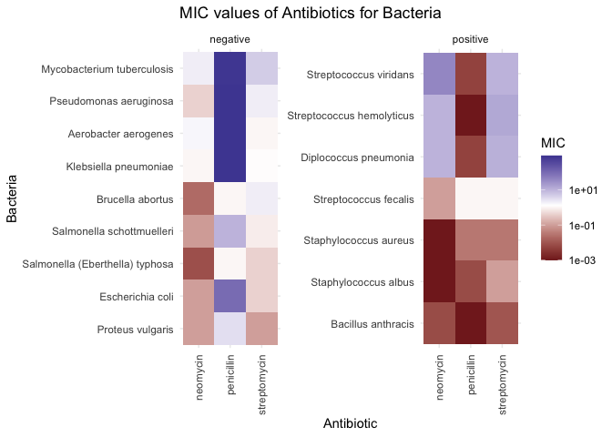
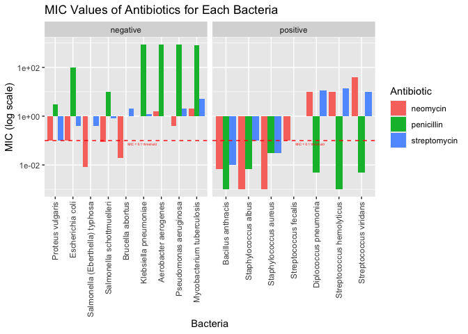
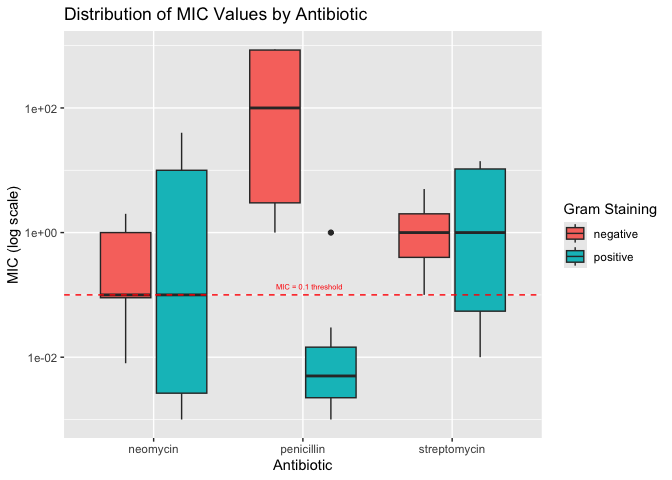
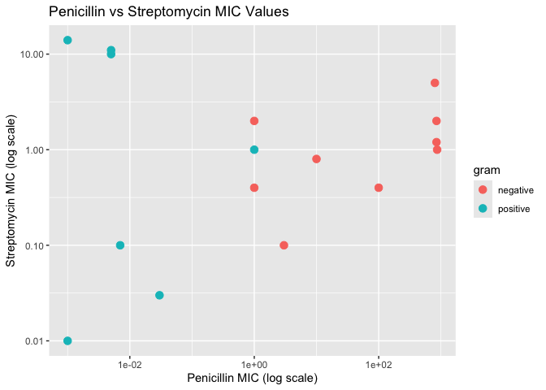
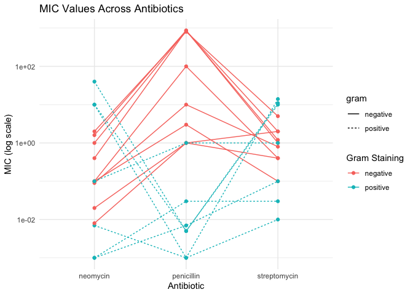

Antibiotics
================
Sparsh Gupta
2025-03-03

*Purpose*: Creating effective data visualizations is an *iterative*
process; very rarely will the first graph you make be the most
effective. The most effective thing you can do to be successful in this
iterative process is to *try multiple graphs* of the same data.

Furthermore, judging the effectiveness of a visual is completely
dependent on *the question you are trying to answer*. A visual that is
totally ineffective for one question may be perfect for answering a
different question.

In this challenge, you will practice *iterating* on data visualization,
and will anchor the *assessment* of your visuals using two different
questions.

*Note*: Please complete your initial visual design **alone**. Work on
both of your graphs alone, and save a version to your repo *before*
coming together with your team. This way you can all bring a diversity
of ideas to the table!

<!-- include-rubric -->

# Grading Rubric

<!-- -------------------------------------------------- -->

Unlike exercises, **challenges will be graded**. The following rubrics
define how you will be graded, both on an individual and team basis.

## Individual

<!-- ------------------------- -->

| Category | Needs Improvement | Satisfactory |
|----|----|----|
| Effort | Some task **q**’s left unattempted | All task **q**’s attempted |
| Observed | Did not document observations, or observations incorrect | Documented correct observations based on analysis |
| Supported | Some observations not clearly supported by analysis | All observations clearly supported by analysis (table, graph, etc.) |
| Assessed | Observations include claims not supported by the data, or reflect a level of certainty not warranted by the data | Observations are appropriately qualified by the quality & relevance of the data and (in)conclusiveness of the support |
| Specified | Uses the phrase “more data are necessary” without clarification | Any statement that “more data are necessary” specifies which *specific* data are needed to answer what *specific* question |
| Code Styled | Violations of the [style guide](https://style.tidyverse.org/) hinder readability | Code sufficiently close to the [style guide](https://style.tidyverse.org/) |

## Submission

<!-- ------------------------- -->

Make sure to commit both the challenge report (`report.md` file) and
supporting files (`report_files/` folder) when you are done! Then submit
a link to Canvas. **Your Challenge submission is not complete without
all files uploaded to GitHub.**

``` r
library(tidyverse)
```

    ## ── Attaching core tidyverse packages ──────────────────────── tidyverse 2.0.0 ──
    ## ✔ dplyr     1.1.4     ✔ readr     2.1.5
    ## ✔ forcats   1.0.0     ✔ stringr   1.5.1
    ## ✔ ggplot2   3.5.1     ✔ tibble    3.2.1
    ## ✔ lubridate 1.9.4     ✔ tidyr     1.3.1
    ## ✔ purrr     1.0.2     
    ## ── Conflicts ────────────────────────────────────────── tidyverse_conflicts() ──
    ## ✖ dplyr::filter() masks stats::filter()
    ## ✖ dplyr::lag()    masks stats::lag()
    ## ℹ Use the conflicted package (<http://conflicted.r-lib.org/>) to force all conflicts to become errors

``` r
library(ggrepel)
```

*Background*: The data\[1\] we study in this challenge report the
[*minimum inhibitory
concentration*](https://en.wikipedia.org/wiki/Minimum_inhibitory_concentration)
(MIC) of three drugs for different bacteria. The smaller the MIC for a
given drug and bacteria pair, the more practical the drug is for
treating that particular bacteria. An MIC value of *at most* 0.1 is
considered necessary for treating human patients.

These data report MIC values for three antibiotics—penicillin,
streptomycin, and neomycin—on 16 bacteria. Bacteria are categorized into
a genus based on a number of features, including their resistance to
antibiotics.

``` r
## NOTE: If you extracted all challenges to the same location,
## you shouldn't have to change this filename
filename <- "./data/antibiotics.csv"

## Load the data
df_antibiotics <- read_csv(filename, show_col_types = FALSE)
df_antibiotics %>% knitr::kable()
```

| bacteria                        | penicillin | streptomycin | neomycin | gram     |
|:--------------------------------|-----------:|-------------:|---------:|:---------|
| Aerobacter aerogenes            |    870.000 |         1.00 |    1.600 | negative |
| Brucella abortus                |      1.000 |         2.00 |    0.020 | negative |
| Bacillus anthracis              |      0.001 |         0.01 |    0.007 | positive |
| Diplococcus pneumonia           |      0.005 |        11.00 |   10.000 | positive |
| Escherichia coli                |    100.000 |         0.40 |    0.100 | negative |
| Klebsiella pneumoniae           |    850.000 |         1.20 |    1.000 | negative |
| Mycobacterium tuberculosis      |    800.000 |         5.00 |    2.000 | negative |
| Proteus vulgaris                |      3.000 |         0.10 |    0.100 | negative |
| Pseudomonas aeruginosa          |    850.000 |         2.00 |    0.400 | negative |
| Salmonella (Eberthella) typhosa |      1.000 |         0.40 |    0.008 | negative |
| Salmonella schottmuelleri       |     10.000 |         0.80 |    0.090 | negative |
| Staphylococcus albus            |      0.007 |         0.10 |    0.001 | positive |
| Staphylococcus aureus           |      0.030 |         0.03 |    0.001 | positive |
| Streptococcus fecalis           |      1.000 |         1.00 |    0.100 | positive |
| Streptococcus hemolyticus       |      0.001 |        14.00 |   10.000 | positive |
| Streptococcus viridans          |      0.005 |        10.00 |   40.000 | positive |

# Visualization

<!-- -------------------------------------------------- -->

### **q1** Prototype 5 visuals

To start, construct **5 qualitatively different visualizations of the
data** `df_antibiotics`. These **cannot** be simple variations on the
same graph; for instance, if two of your visuals could be made identical
by calling `coord_flip()`, then these are *not* qualitatively different.

For all five of the visuals, you must show information on *all 16
bacteria*. For the first two visuals, you must *show all variables*.

*Hint 1*: Try working quickly on this part; come up with a bunch of
ideas, and don’t fixate on any one idea for too long. You will have a
chance to refine later in this challenge.

*Hint 2*: The data `df_antibiotics` are in a *wide* format; it may be
helpful to `pivot_longer()` the data to make certain visuals easier to
construct.

``` r
df_long <- df_antibiotics %>%
  pivot_longer(
    cols = c(penicillin, streptomycin, neomycin),
    names_to = "antibiotic", values_to = "MIC"
  )
```

#### Visual 1 (All variables)

In this visual you must show *all three* effectiveness values for *all
16 bacteria*. This means **it must be possible to identify each of the
16 bacteria by name.** You must also show whether or not each bacterium
is Gram positive or negative.

``` r
df_long %>%
  mutate(bacteria = fct_reorder(bacteria, MIC)) %>%
  ggplot(aes(antibiotic, bacteria, fill = MIC)) +
  geom_tile() +
  scale_fill_gradient2(midpoint = 0.1, trans = "log10") +
  theme_minimal() +
  theme(axis.text.x = element_text(angle = 90, vjust = 0.5, hjust = 1)) +
  labs(
    title = "MIC values of Antibiotics for Bacteria",
    x = "Antibiotic",
    y = "Bacteria"
  ) +
  facet_wrap(~gram, scales = "free_y")
```

<!-- -->

#### Visual 2 (All variables)

In this visual you must show *all three* effectiveness values for *all
16 bacteria*. This means **it must be possible to identify each of the
16 bacteria by name.** You must also show whether or not each bacterium
is Gram positive or negative.

Note that your visual must be *qualitatively different* from *all* of
your other visuals.

``` r
df_long %>%
  mutate(bacteria = fct_reorder(bacteria, MIC)) %>%
  ggplot(aes(bacteria, MIC, fill = antibiotic)) +
  geom_bar(stat = "identity", position = "dodge") +
  scale_y_log10() +
  geom_hline(yintercept = 0.1, linetype = "dashed", color = "red", linewidth = 0.5) + 
  annotate("text", x = Inf, y = 0.1, label = "MIC = 0.1 threshold", vjust = 2, hjust = 2.75, color = "red", size = 1.25) +
  theme(axis.text.x = element_text(angle = 90, hjust = 1, vjust = 0.5)) +
  labs(
    title = "MIC Values of Antibiotics for Each Bacteria",
    x = "Bacteria", 
    y = "MIC (log scale)", 
    fill = "Antibiotic"
  ) +
  facet_wrap(~gram, scales = "free_x")
```

<!-- -->

#### Visual 3 (Some variables)

In this visual you may show a *subset* of the variables (`penicillin`,
`streptomycin`, `neomycin`, `gram`), but you must still show *all 16
bacteria*.

Note that your visual must be *qualitatively different* from *all* of
your other visuals.

``` r
df_long %>%
  ggplot(aes(antibiotic, MIC, fill = gram)) +
  geom_boxplot() +
  scale_y_log10() +
  geom_hline(yintercept = 0.1, linetype = "dashed", color = "red", linewidth = 0.5) + 
  annotate("text", x = Inf, y = 0.1, label = "MIC = 0.1 threshold", vjust = -1, hjust = 4, color = "red", size = 2) +
  labs(
    title = "Distribution of MIC Values by Antibiotic",
    x = "Antibiotic", 
    y = "MIC (log scale)", 
    fill = "Gram Staining"
  )
```

<!-- -->

Inspecting the one extreme outlier for penicillin in visual 3 (box plot)

``` r
penicillin_gp <- df_long %>% filter(antibiotic == "penicillin", gram == "positive")

Q1 <- quantile(penicillin_gp$MIC, 0.25)
Q3 <- quantile(penicillin_gp$MIC, 0.75)
IQR_value <- Q3 - Q1
upper_bound <- Q3 + 1.5 * IQR_value

outlier_bacteria <- penicillin_gp %>% filter(MIC > upper_bound)

print(outlier_bacteria)
```

    ## # A tibble: 1 × 4
    ##   bacteria              gram     antibiotic   MIC
    ##   <chr>                 <chr>    <chr>      <dbl>
    ## 1 Streptococcus fecalis positive penicillin     1

#### Visual 4 (Some variables)

In this visual you may show a *subset* of the variables (`penicillin`,
`streptomycin`, `neomycin`, `gram`), but you must still show *all 16
bacteria*.

Note that your visual must be *qualitatively different* from *all* of
your other visuals.

``` r
df_antibiotics %>%
  ggplot(aes(penicillin, streptomycin, color = gram)) +
  geom_point(size = 3) +
  scale_x_log10() +
  scale_y_log10() +
  labs(
    title = "Penicillin vs Streptomycin MIC Values",
    x = "Penicillin MIC (log scale)", 
    y = "Streptomycin MIC (log scale)"
  )
```

<!-- -->

#### Visual 5 (Some variables)

In this visual you may show a *subset* of the variables (`penicillin`,
`streptomycin`, `neomycin`, `gram`), but you must still show *all 16
bacteria*.

Note that your visual must be *qualitatively different* from *all* of
your other visuals.

``` r
df_long %>%
  ggplot(aes(antibiotic, MIC, group = bacteria, color = gram)) +
  geom_line(aes(linetype = gram)) +
  geom_point() +
  scale_y_log10() +
  theme_minimal() +
  labs(
    title = "MIC Values Across Antibiotics",
    x = "Antibiotic", 
    y = "MIC (log scale)", 
    color = "Gram Staining"
  ) 
```

<!-- -->

### **q2** Assess your visuals

There are **two questions** below; use your five visuals to help answer
both Guiding Questions. Note that you must also identify which of your
five visuals were most helpful in answering the questions.

*Hint 1*: It’s possible that *none* of your visuals is effective in
answering the questions below. You may need to revise one or more of
your visuals to answer the questions below!

*Hint 2*: It’s **highly unlikely** that the same visual is the most
effective at helping answer both guiding questions. **Use this as an
opportunity to think about why this is.**

#### Guiding Question 1

> How do the three antibiotics vary in their effectiveness against
> bacteria of different genera and Gram stain?

**Observations:**

What is your response to the question above?

- The MIC values provide information about antibiotic effectiveness.
  Lower MIC values indicate higher effectiveness.

- Penicillin appears to be more effective against Gram-positive bacteria
  (lower MIC values in most cases except for one outlier bacteria -
  *Streptococcus fecalis*), while neomycin and streptomycin show varied
  effectiveness across both Gram-positive and Gram-negative bacteria. We
  can also see that penicllin is least effective on Gram-negative
  bacteria when compared to neomycin and streptomycin.

- Visual 1 (the heatmap), visual 2 (the bar plot), and the visual 5
  (line chart) clearly show differences in MIC values across antibiotics
  and bacterial genera.

- Visual 3 (the box plot) demonstrates the distribution of the
  effectiveness based on Gram staining and visually distinguishes
  antibiotic performance.

Which of your visuals above (1 through 5) is **most effective** at
helping to answer this question?

- Visual 3

Why?

- Visual 3 effectively summarizes MIC distribution across Gram-positive
  and Gram-negative bacteria for each antibiotic.

- It provides a direct comparison between the antibiotics, showing that
  penicillin generally has lower MIC values for Gram-positive bacteria
  while neomycin and streptomycin have more varied distributions.

- Unlike the other plots, visual 3 provides a clearer overall trend,
  rather than individual values for each bacterium.

#### Guiding Question 2

In 1974 *Diplococcus pneumoniae* was renamed *Streptococcus pneumoniae*,
and in 1984 *Streptococcus fecalis* was renamed *Enterococcus fecalis*
\[2\].

> Why was *Diplococcus pneumoniae* was renamed *Streptococcus
> pneumoniae*?

**Observations:**

What is your response to the question above?

- The renaming suggests that *Diplococcus pneumoniae* was reclassified
  into the streptococcus genus, likely due to genetic, structural, or
  functional similarities.

- *Streptococcus pneumoniae* shares more characteristics with other
  *Streptococcus* species, possibly in morphology (chain-forming cocci
  rather than diplococci) or genetic sequencing.

Which of your visuals above (1 through 5) is **most effective** at
helping to answer this question?

- Visual 1

Why?

- The heatmap groups bacteria into Gram-positive and Gram-negative
  categories.

- We can see within the heatmap for the Gram-positive bacteria, the
  effect (MIC values) of the antibiotics on *Diplococcus pneumoniae*
  looks very similar to what the antibiotics have on two bacteria from
  the *Streptococcus* species, *Streptococcus viridans* and
  *Streptococcus hemolyticus*.

- This suggests that *Diplococcus pneumoniae* shares antibiotic response
  characteristics with *Streptococcus*, reinforcing its
  reclassification.

- While this plot or dataset is not enough information to obtain a
  direct taxonomic reason, they support the idea that both bacteria
  respond similarly to antibiotics, possibly due to shared cell wall
  structures or genetic similarities.

# References

<!-- -------------------------------------------------- -->

\[1\] Neomycin in skin infections: A new topical antibiotic with wide
antibacterial range and rarely sensitizing. Scope. 1951;3(5):4-7.

\[2\] Wainer and Lysen, “That’s Funny…” *American Scientist* (2009)
[link](https://www.americanscientist.org/article/thats-funny)
