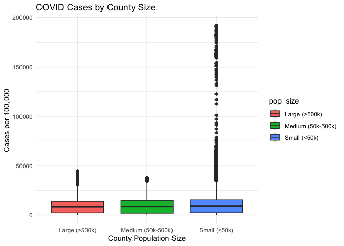
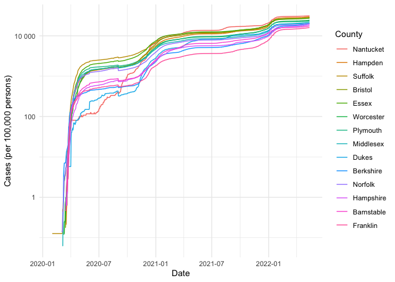

COVID-19
================
Sparsh Gupta
2025-03-07

- [Grading Rubric](#grading-rubric)
  - [Individual](#individual)
  - [Submission](#submission)
- [The Big Picture](#the-big-picture)
- [Get the Data](#get-the-data)
  - [alNavigating the Census Bureau](#alnavigating-the-census-bureau)
    - [**q1** Load Table `B01003` into the following tibble. Make sure
      the column names are
      `id, Geographic Area Name, Estimate!!Total, Margin of Error!!Total`.](#q1-load-table-b01003-into-the-following-tibble-make-sure-the-column-names-are-id-geographic-area-name-estimatetotal-margin-of-errortotal)
  - [Automated Download of NYT Data](#automated-download-of-nyt-data)
    - [**q2** Visit the NYT GitHub repo and find the URL for the **raw**
      US County-level data. Assign that URL as a string to the variable
      below.](#q2-visit-the-nyt-github-repo-and-find-the-url-for-the-raw-us-county-level-data-assign-that-url-as-a-string-to-the-variable-below)
- [Join the Data](#join-the-data)
  - [**q3** Process the `id` column of `df_pop` to create a `fips`
    column.](#q3-process-the-id-column-of-df_pop-to-create-a-fips-column)
  - [**q4** Join `df_covid` with `df_q3` by the `fips` column. Use the
    proper type of join to preserve *only* the rows in
    `df_covid`.](#q4-join-df_covid-with-df_q3-by-the-fips-column-use-the-proper-type-of-join-to-preserve-only-the-rows-in-df_covid)
- [Analyze](#analyze)
  - [Normalize](#normalize)
    - [**q5** Use the `population` estimates in `df_data` to normalize
      `cases` and `deaths` to produce per 100,000 counts \[3\]. Store
      these values in the columns `cases_per100k` and
      `deaths_per100k`.](#q5-use-the-population-estimates-in-df_data-to-normalize-cases-and-deaths-to-produce-per-100000-counts-3-store-these-values-in-the-columns-cases_per100k-and-deaths_per100k)
  - [Guided EDA](#guided-eda)
    - [**q6** Compute some summaries](#q6-compute-some-summaries)
    - [**q7** Find and compare the top
      10](#q7-find-and-compare-the-top-10)
  - [Self-directed EDA](#self-directed-eda)
    - [**q8** Drive your own ship: You’ve just put together a very rich
      dataset; you now get to explore! Pick your own direction and
      generate at least one punchline figure to document an interesting
      finding. I give a couple tips & ideas
      below:](#q8-drive-your-own-ship-youve-just-put-together-a-very-rich-dataset-you-now-get-to-explore-pick-your-own-direction-and-generate-at-least-one-punchline-figure-to-document-an-interesting-finding-i-give-a-couple-tips--ideas-below)
    - [Ideas](#ideas)
    - [Aside: Some visualization
      tricks](#aside-some-visualization-tricks)
    - [Geographic exceptions](#geographic-exceptions)
- [Notes](#notes)

*Purpose*: In this challenge, you’ll learn how to navigate the U.S.
Census Bureau website, programmatically download data from the internet,
and perform a county-level population-weighted analysis of current
COVID-19 trends. This will give you the base for a very deep
investigation of COVID-19, which we’ll build upon for Project 1.

<!-- include-rubric -->

# Grading Rubric

<!-- -------------------------------------------------- -->

Unlike exercises, **challenges will be graded**. The following rubrics
define how you will be graded, both on an individual and team basis.

## Individual

<!-- ------------------------- -->

| Category | Needs Improvement | Satisfactory |
|----|----|----|
| Effort | Some task **q**’s left unattempted | All task **q**’s attempted |
| Observed | Did not document observations, or observations incorrect | Documented correct observations based on analysis |
| Supported | Some observations not clearly supported by analysis | All observations clearly supported by analysis (table, graph, etc.) |
| Assessed | Observations include claims not supported by the data, or reflect a level of certainty not warranted by the data | Observations are appropriately qualified by the quality & relevance of the data and (in)conclusiveness of the support |
| Specified | Uses the phrase “more data are necessary” without clarification | Any statement that “more data are necessary” specifies which *specific* data are needed to answer what *specific* question |
| Code Styled | Violations of the [style guide](https://style.tidyverse.org/) hinder readability | Code sufficiently close to the [style guide](https://style.tidyverse.org/) |

## Submission

<!-- ------------------------- -->

Make sure to commit both the challenge report (`report.md` file) and
supporting files (`report_files/` folder) when you are done! Then submit
a link to Canvas. **Your Challenge submission is not complete without
all files uploaded to GitHub.**

``` r
library(tidyverse)
```

    ## ── Attaching core tidyverse packages ──────────────────────── tidyverse 2.0.0 ──
    ## ✔ dplyr     1.1.4     ✔ readr     2.1.5
    ## ✔ forcats   1.0.0     ✔ stringr   1.5.1
    ## ✔ ggplot2   3.5.1     ✔ tibble    3.2.1
    ## ✔ lubridate 1.9.4     ✔ tidyr     1.3.1
    ## ✔ purrr     1.0.2     
    ## ── Conflicts ────────────────────────────────────────── tidyverse_conflicts() ──
    ## ✖ dplyr::filter() masks stats::filter()
    ## ✖ dplyr::lag()    masks stats::lag()
    ## ℹ Use the conflicted package (<http://conflicted.r-lib.org/>) to force all conflicts to become errors

``` r
library(ggplot2)
library(dplyr)
```

*Background*:
[COVID-19](https://en.wikipedia.org/wiki/Coronavirus_disease_2019) is
the disease caused by the virus SARS-CoV-2. In 2020 it became a global
pandemic, leading to huge loss of life and tremendous disruption to
society. The New York Times (as of writing) publishes up-to-date data on
the progression of the pandemic across the United States—we will study
these data in this challenge.

*Optional Readings*: I’ve found this [ProPublica
piece](https://www.propublica.org/article/how-to-understand-covid-19-numbers)
on “How to understand COVID-19 numbers” to be very informative!

# The Big Picture

<!-- -------------------------------------------------- -->

We’re about to go through *a lot* of weird steps, so let’s first fix the
big picture firmly in mind:

We want to study COVID-19 in terms of data: both case counts (number of
infections) and deaths. We’re going to do a county-level analysis in
order to get a high-resolution view of the pandemic. Since US counties
can vary widely in terms of their population, we’ll need population
estimates in order to compute infection rates (think back to the
`Titanic` challenge).

That’s the high-level view; now let’s dig into the details.

# Get the Data

<!-- -------------------------------------------------- -->

1.  County-level population estimates (Census Bureau)
2.  County-level COVID-19 counts (New York Times)

## alNavigating the Census Bureau

<!-- ------------------------- -->

**Steps**: Our objective is to find the 2018 American Community
Survey\[1\] (ACS) Total Population estimates, disaggregated by counties.
To check your results, this is Table `B01003`.

1.  Go to [data.census.gov](data.census.gov).
2.  Scroll down and click `View Tables`.
3.  Apply filters to find the ACS **Total Population** estimates,
    disaggregated by counties. I used the filters:

- `Topics > Populations and People > Counts, Estimates, and Projections > Population Total`
- `Geography > County > All counties in United States`

5.  Select the **Total Population** table and click the `Download`
    button to download the data; make sure to select the 2018 5-year
    estimates.
6.  Unzip and move the data to your `challenges/data` folder.

- Note that the data will have a crazy-long filename like
  `ACSDT5Y2018.B01003_data_with_overlays_2020-07-26T094857.csv`. That’s
  because metadata is stored in the filename, such as the year of the
  estimate (`Y2018`) and my access date (`2020-07-26`). **Your filename
  will vary based on when you download the data**, so make sure to copy
  the filename that corresponds to what you downloaded!

### **q1** Load Table `B01003` into the following tibble. Make sure the column names are `id, Geographic Area Name, Estimate!!Total, Margin of Error!!Total`.

*Hint*: You will need to use the `skip` keyword when loading these data!

``` r
## Load the census bureau data

file_path <- "data/ACSDT5Y2018.B01003-Data.csv"

df_pop <- read_csv(file_path, skip = 2, col_names = c("id", "Geographic Area Name", "Estimate!!Total", "Margin of Error!!Total"), show_col_types = FALSE)
df_pop <- df_pop[, 1:4]

head(df_pop)
```

    ## # A tibble: 6 × 4
    ##   id             `Geographic Area Name` `Estimate!!Total` Margin of Error!!Tot…¹
    ##   <chr>          <chr>                              <dbl> <chr>                 
    ## 1 0500000US01001 Autauga County, Alaba…             55200 *****                 
    ## 2 0500000US01003 Baldwin County, Alaba…            208107 *****                 
    ## 3 0500000US01005 Barbour County, Alaba…             25782 *****                 
    ## 4 0500000US01007 Bibb County, Alabama               22527 *****                 
    ## 5 0500000US01009 Blount County, Alabama             57645 *****                 
    ## 6 0500000US01011 Bullock County, Alaba…             10352 *****                 
    ## # ℹ abbreviated name: ¹​`Margin of Error!!Total`

*Note*: You can find information on 1-year, 3-year, and 5-year estimates
[here](https://www.census.gov/programs-surveys/acs/guidance/estimates.html).
The punchline is that 5-year estimates are more reliable but less
current.

## Automated Download of NYT Data

<!-- ------------------------- -->

ACS 5-year estimates don’t change all that often, but the COVID-19 data
are changing rapidly. To that end, it would be nice to be able to
*programmatically* download the most recent data for analysis; that way
we can update our analysis whenever we want simply by re-running our
notebook. This next problem will have you set up such a pipeline.

The New York Times is publishing up-to-date data on COVID-19 on
[GitHub](https://github.com/nytimes/covid-19-data).

### **q2** Visit the NYT [GitHub](https://github.com/nytimes/covid-19-data) repo and find the URL for the **raw** US County-level data. Assign that URL as a string to the variable below.

``` r
## URL for the NYT covid-19 county-level data
url_counties <- "https://raw.githubusercontent.com/nytimes/covid-19-data/master/us-counties.csv"
```

Once you have the url, the following code will download a local copy of
the data, then load the data into R.

``` r
## NOTE: No need to change this; just execute
## Set the filename of the data to download
filename_nyt <- "./data/nyt_counties.csv"

## Download the data locally
curl::curl_download(
        url_counties,
        destfile = filename_nyt
      )

## Loads the downloaded csv
df_covid <- read_csv(filename_nyt, show_col_types = FALSE)

head(df_covid)
```

    ## # A tibble: 6 × 6
    ##   date       county    state      fips  cases deaths
    ##   <date>     <chr>     <chr>      <chr> <dbl>  <dbl>
    ## 1 2020-01-21 Snohomish Washington 53061     1      0
    ## 2 2020-01-22 Snohomish Washington 53061     1      0
    ## 3 2020-01-23 Snohomish Washington 53061     1      0
    ## 4 2020-01-24 Cook      Illinois   17031     1      0
    ## 5 2020-01-24 Snohomish Washington 53061     1      0
    ## 6 2020-01-25 Orange    California 06059     1      0

You can now re-run the chunk above (or the entire notebook) to pull the
most recent version of the data. Thus you can periodically re-run this
notebook to check in on the pandemic as it evolves.

*Note*: You should feel free to copy-paste the code above for your own
future projects!

# Join the Data

<!-- -------------------------------------------------- -->

To get a sense of our task, let’s take a glimpse at our two data
sources.

``` r
## NOTE: No need to change this; just execute
df_pop %>% glimpse
```

    ## Rows: 3,220
    ## Columns: 4
    ## $ id                       <chr> "0500000US01001", "0500000US01003", "0500000U…
    ## $ `Geographic Area Name`   <chr> "Autauga County, Alabama", "Baldwin County, A…
    ## $ `Estimate!!Total`        <dbl> 55200, 208107, 25782, 22527, 57645, 10352, 20…
    ## $ `Margin of Error!!Total` <chr> "*****", "*****", "*****", "*****", "*****", …

``` r
df_covid %>% glimpse
```

    ## Rows: 2,502,832
    ## Columns: 6
    ## $ date   <date> 2020-01-21, 2020-01-22, 2020-01-23, 2020-01-24, 2020-01-24, 20…
    ## $ county <chr> "Snohomish", "Snohomish", "Snohomish", "Cook", "Snohomish", "Or…
    ## $ state  <chr> "Washington", "Washington", "Washington", "Illinois", "Washingt…
    ## $ fips   <chr> "53061", "53061", "53061", "17031", "53061", "06059", "17031", …
    ## $ cases  <dbl> 1, 1, 1, 1, 1, 1, 1, 1, 1, 1, 1, 1, 1, 1, 1, 1, 1, 1, 1, 1, 1, …
    ## $ deaths <dbl> 0, 0, 0, 0, 0, 0, 0, 0, 0, 0, 0, 0, 0, 0, 0, 0, 0, 0, 0, 0, 0, …

To join these datasets, we’ll need to use [FIPS county
codes](https://en.wikipedia.org/wiki/FIPS_county_code).\[2\] The last
`5` digits of the `id` column in `df_pop` is the FIPS county code, while
the NYT data `df_covid` already contains the `fips`.

### **q3** Process the `id` column of `df_pop` to create a `fips` column.

``` r
## Create a `fips` column by extracting the county code
df_q3 <- df_pop %>%
  mutate(fips = str_sub(id, -5, -1))

head(df_q3)
```

    ## # A tibble: 6 × 5
    ##   id       `Geographic Area Name` `Estimate!!Total` Margin of Error!!Tot…¹ fips 
    ##   <chr>    <chr>                              <dbl> <chr>                  <chr>
    ## 1 0500000… Autauga County, Alaba…             55200 *****                  01001
    ## 2 0500000… Baldwin County, Alaba…            208107 *****                  01003
    ## 3 0500000… Barbour County, Alaba…             25782 *****                  01005
    ## 4 0500000… Bibb County, Alabama               22527 *****                  01007
    ## 5 0500000… Blount County, Alabama             57645 *****                  01009
    ## 6 0500000… Bullock County, Alaba…             10352 *****                  01011
    ## # ℹ abbreviated name: ¹​`Margin of Error!!Total`

Use the following test to check your answer.

``` r
## NOTE: No need to change this
## Check known county
assertthat::assert_that(
              (df_q3 %>%
              filter(str_detect(`Geographic Area Name`, "Autauga County")) %>%
              pull(fips)) == "01001"
            )
```

    ## [1] TRUE

``` r
print("Very good!")
```

    ## [1] "Very good!"

### **q4** Join `df_covid` with `df_q3` by the `fips` column. Use the proper type of join to preserve *only* the rows in `df_covid`.

``` r
## Join df_covid and df_q3 by fips.
df_q4 <- df_covid %>%
  left_join(df_q3, by = "fips")

head(df_q4)
```

    ## # A tibble: 6 × 10
    ##   date       county    state     fips  cases deaths id    `Geographic Area Name`
    ##   <date>     <chr>     <chr>     <chr> <dbl>  <dbl> <chr> <chr>                 
    ## 1 2020-01-21 Snohomish Washingt… 53061     1      0 0500… Snohomish County, Was…
    ## 2 2020-01-22 Snohomish Washingt… 53061     1      0 0500… Snohomish County, Was…
    ## 3 2020-01-23 Snohomish Washingt… 53061     1      0 0500… Snohomish County, Was…
    ## 4 2020-01-24 Cook      Illinois  17031     1      0 0500… Cook County, Illinois 
    ## 5 2020-01-24 Snohomish Washingt… 53061     1      0 0500… Snohomish County, Was…
    ## 6 2020-01-25 Orange    Californ… 06059     1      0 0500… Orange County, Califo…
    ## # ℹ 2 more variables: `Estimate!!Total` <dbl>, `Margin of Error!!Total` <chr>

Use the following test to check your answer.

``` r
## NOTE: No need to change this
if (!any(df_q4 %>% pull(fips) %>% str_detect(., "02105"), na.rm = TRUE)) {
  assertthat::assert_that(TRUE)
} else {
  print(str_c(
    "Your df_q4 contains a row for the Hoonah-Angoon Census Area (AK),",
    "which is not in df_covid. You used the incorrect join type.",
    sep = " "
  ))
  assertthat::assert_that(FALSE)
}
```

    ## [1] TRUE

``` r
if (any(df_q4 %>% pull(fips) %>% str_detect(., "78010"), na.rm = TRUE)) {
  assertthat::assert_that(TRUE)
} else {
  print(str_c(
    "Your df_q4 does not include St. Croix, US Virgin Islands,",
    "which is in df_covid. You used the incorrect join type.",
    sep = " "
  ))
  assertthat::assert_that(FALSE)
}
```

    ## [1] TRUE

``` r
print("Very good!")
```

    ## [1] "Very good!"

For convenience, I down-select some columns and produce more convenient
column names.

``` r
## NOTE: No need to change; run this to produce a more convenient tibble
df_data <-
  df_q4 %>%
  select(
    date,
    county,
    state,
    fips,
    cases,
    deaths,
    population = `Estimate!!Total`
  )
```

# Analyze

<!-- -------------------------------------------------- -->

Now that we’ve done the hard work of loading and wrangling the data, we
can finally start our analysis. Our first step will be to produce county
population-normalized cases and death counts. Then we will explore the
data.

## Normalize

<!-- ------------------------- -->

### **q5** Use the `population` estimates in `df_data` to normalize `cases` and `deaths` to produce per 100,000 counts \[3\]. Store these values in the columns `cases_per100k` and `deaths_per100k`.

``` r
## Normalize cases and deaths
df_normalized <-
  df_data %>%
  mutate(
    cases_per100k = (cases / population) * 100000,
    deaths_per100k = (deaths / population) * 100000
  )

head(df_normalized)
```

    ## # A tibble: 6 × 9
    ##   date       county    state      fips  cases deaths population cases_per100k
    ##   <date>     <chr>     <chr>      <chr> <dbl>  <dbl>      <dbl>         <dbl>
    ## 1 2020-01-21 Snohomish Washington 53061     1      0     786620        0.127 
    ## 2 2020-01-22 Snohomish Washington 53061     1      0     786620        0.127 
    ## 3 2020-01-23 Snohomish Washington 53061     1      0     786620        0.127 
    ## 4 2020-01-24 Cook      Illinois   17031     1      0    5223719        0.0191
    ## 5 2020-01-24 Snohomish Washington 53061     1      0     786620        0.127 
    ## 6 2020-01-25 Orange    California 06059     1      0    3164182        0.0316
    ## # ℹ 1 more variable: deaths_per100k <dbl>

You may use the following test to check your work.

``` r
## NOTE: No need to change this
## Check known county data
if (any(df_normalized %>% pull(date) %>% str_detect(., "2020-01-21"))) {
  assertthat::assert_that(TRUE)
} else {
  print(str_c(
    "Date 2020-01-21 not found; did you download the historical data (correct),",
    "or just the most recent data (incorrect)?",
    sep = " "
  ))
  assertthat::assert_that(FALSE)
}
```

    ## [1] TRUE

``` r
if (any(df_normalized %>% pull(date) %>% str_detect(., "2022-05-13"))) {
  assertthat::assert_that(TRUE)
} else {
  print(str_c(
    "Date 2022-05-13 not found; did you download the historical data (correct),",
    "or a single year's data (incorrect)?",
    sep = " "
  ))
  assertthat::assert_that(FALSE)
}
```

    ## [1] TRUE

``` r
## Check datatypes
assertthat::assert_that(is.numeric(df_normalized$cases))
```

    ## [1] TRUE

``` r
assertthat::assert_that(is.numeric(df_normalized$deaths))
```

    ## [1] TRUE

``` r
assertthat::assert_that(is.numeric(df_normalized$population))
```

    ## [1] TRUE

``` r
assertthat::assert_that(is.numeric(df_normalized$cases_per100k))
```

    ## [1] TRUE

``` r
assertthat::assert_that(is.numeric(df_normalized$deaths_per100k))
```

    ## [1] TRUE

``` r
## Check that normalization is correct
assertthat::assert_that(
              abs(df_normalized %>%
               filter(
                 str_detect(county, "Snohomish"),
                 date == "2020-01-21"
               ) %>%
              pull(cases_per100k) - 0.127) < 1e-3
            )
```

    ## [1] TRUE

``` r
assertthat::assert_that(
              abs(df_normalized %>%
               filter(
                 str_detect(county, "Snohomish"),
                 date == "2020-01-21"
               ) %>%
              pull(deaths_per100k) - 0) < 1e-3
            )
```

    ## [1] TRUE

``` r
print("Excellent!")
```

    ## [1] "Excellent!"

## Guided EDA

<!-- ------------------------- -->

Before turning you loose, let’s complete a couple guided EDA tasks.

### **q6** Compute some summaries

Compute the mean and standard deviation for `cases_per100k` and
`deaths_per100k`. *Make sure to carefully choose **which rows** to
include in your summaries,* and justify why!

``` r
## Compute mean and sd for cases_per100k and deaths_per100k
df_summary <- df_normalized %>%
  filter(!is.na(population) & population > 0 & !is.na(cases_per100k) & !is.na(deaths_per100k)) %>%
  summarise(
    mean_cases_per100k = mean(cases_per100k, na.rm = TRUE),
    sd_cases_per100k = sd(cases_per100k, na.rm = TRUE),
    mean_deaths_per100k = mean(deaths_per100k, na.rm = TRUE),
    sd_deaths_per100k = sd(deaths_per100k, na.rm = TRUE)
  )

df_summary
```

    ## # A tibble: 1 × 4
    ##   mean_cases_per100k sd_cases_per100k mean_deaths_per100k sd_deaths_per100k
    ##                <dbl>            <dbl>               <dbl>             <dbl>
    ## 1             10094.            8484.                174.              159.

- Which rows did you pick?
  - Rows where the `population` is not missing and greater than zero.
  - Rows where `cases_per100k` and `deaths_per100k` are not missing
    (`NA`).
- Why?
  - Missing or zero population values would cause division errors in
    normalization and also lead to incorrect statistical caluculations.
  - Some early data points may be misleading due to underreporting or
    lack of widespread testing.

### **q7** Find and compare the top 10

Find the top 10 counties in terms of `cases_per100k`, and the top 10 in
terms of `deaths_per100k`. Report the population of each county along
with the per-100,000 counts. Compare the counts against the mean values
you found in q6. Note any observations.

``` r
## Find the top 10 max cases_per100k counties; report populations as well
top_10_cases <- df_normalized %>%
  filter(!is.na(population) & population > 0 & !is.na(cases_per100k)) %>%
  arrange(desc(cases_per100k)) %>%
  select(date, county, state, population, cases_per100k) %>%
  slice_head(n = 10)

top_10_cases
```

    ## # A tibble: 10 × 5
    ##    date       county state population cases_per100k
    ##    <date>     <chr>  <chr>      <dbl>         <dbl>
    ##  1 2022-05-12 Loving Texas        102       192157.
    ##  2 2022-05-13 Loving Texas        102       192157.
    ##  3 2022-05-09 Loving Texas        102       191176.
    ##  4 2022-05-10 Loving Texas        102       191176.
    ##  5 2022-05-11 Loving Texas        102       191176.
    ##  6 2022-05-08 Loving Texas        102       190196.
    ##  7 2022-05-07 Loving Texas        102       188235.
    ##  8 2022-05-05 Loving Texas        102       187255.
    ##  9 2022-05-06 Loving Texas        102       187255.
    ## 10 2022-05-04 Loving Texas        102       186275.

``` r
## Find the top 10 deaths_per100k counties; report populations as well
top_10_deaths <- df_normalized %>%
  filter(!is.na(population) & population > 0 & !is.na(deaths_per100k)) %>%
  arrange(desc(deaths_per100k)) %>%
  select(date, county, state, population, deaths_per100k) %>%
  slice_head(n = 10)

top_10_deaths
```

    ## # A tibble: 10 × 5
    ##    date       county   state population deaths_per100k
    ##    <date>     <chr>    <chr>      <dbl>          <dbl>
    ##  1 2022-02-19 McMullen Texas        662          1360.
    ##  2 2022-02-20 McMullen Texas        662          1360.
    ##  3 2022-02-21 McMullen Texas        662          1360.
    ##  4 2022-02-22 McMullen Texas        662          1360.
    ##  5 2022-02-23 McMullen Texas        662          1360.
    ##  6 2022-02-24 McMullen Texas        662          1360.
    ##  7 2022-02-25 McMullen Texas        662          1360.
    ##  8 2022-02-26 McMullen Texas        662          1360.
    ##  9 2022-02-27 McMullen Texas        662          1360.
    ## 10 2022-02-28 McMullen Texas        662          1360.

**Observations**:

- Extreme Outliers in Small Counties:
  - The top county for cases per 100k is Loving County, Texas, which has
    an extremely small population (102). Because of this, even a small
    number of cases leads to an extremely high per-100k value.
  - Similarly, McMullen County, Texas tops the deaths per 100k list with
    a population of just 662, meaning a few deaths significantly inflate
    the metric.
  - This suggests that small population counties can show extreme
    fluctuations in per-100k metrics, which may not accurately reflect
    broader trends.
- Repetition of Values:
  - The dataset shows multiple entries for the same county with slightly
    different values, which is because the data is from different dates
    as well.
  - So, this could mean that these counties remained among the hardest
    hit from COVID-19 for an extended period.
- Comparison:
  - Mean cases per 100k from q6: 10,093.54
  - Mean deaths per 100k from q6: 174.31
  - The top counties for cases per 100k are approximately 20 times
    higher and the deaths per 100k are approximately 8 times higher.
- When did these “largest values” occur?
  - For top 10 cases per 100k, all the largest values occur in May 2022.
  - For top 10 deaths per 100k, all the largest values occur in February
    2022.

## Self-directed EDA

<!-- ------------------------- -->

### **q8** Drive your own ship: You’ve just put together a very rich dataset; you now get to explore! Pick your own direction and generate at least one punchline figure to document an interesting finding. I give a couple tips & ideas below:

### Ideas

<!-- ------------------------- -->

- Look for outliers.
- Try web searching for news stories in some of the outlier counties.
- Investigate relationships between county population and counts.
- Do a deep-dive on counties that are important to you (e.g. where you
  or your family live).
- Fix the *geographic exceptions* noted below to study New York City.
- Your own idea!

``` r
df_normalized %>%
  mutate(pop_size = case_when(
    population < 50000 ~ "Small (<50k)",
    population < 500000 ~ "Medium (50k-500k)",
    TRUE ~ "Large (>500k)"
  )) %>%
  ggplot(aes(x = pop_size, y = cases_per100k, fill = pop_size)) +
  geom_boxplot() +
  theme_minimal() +
  labs(
    title = "COVID Cases by County Size",
    x = "County Population Size",
    y = "Cases per 100,000"
  )
```

    ## Warning: Removed 28822 rows containing non-finite outside the scale range
    ## (`stat_boxplot()`).

<!-- -->

**Observations**:

- Higher variability in small counties:

  - Small counties (\<50k population) exhibit extreme outliers (the
    black dots above the box), with cases per 100k reaching nearly
    200,000.

  - This aligns with previous findings (e.g. Loving County, TX) where a
    few cases can drastically increase the per-100k rate.

  - This also suggests that small countries experience high fluctuations
    in case rates, likely due to their small populations and that people
    potentially got reinfected with COVID-19 multiple times. This data
    for small counties biases the overall data for cases per 100 k and
    deaths per 100k, and doesn’t really indicate the trends for medium
    (50k-500k population) and large (\>500k population) counties.

- Lower variation in large counties:

  - Large counties (\>500k) have a more compact distribution with fewer
    extreme outliers.

  - This indicates that larger populations smooth out case rate
    fluctuations.

- Median case rates are similar:

  - The medians for all county sizes appear close to each other, meaning
    that on average, cases per 100k were comparable across population
    sizes.

### Aside: Some visualization tricks

<!-- ------------------------- -->

These data get a little busy, so it’s helpful to know a few `ggplot`
tricks to help with the visualization. Here’s an example focused on
Massachusetts.

``` r
## NOTE: No need to change this; just an example
df_normalized %>%
  filter(
    state == "Massachusetts", # Focus on Mass only
    !is.na(fips), # fct_reorder2 can choke with missing data
  ) %>%

  ggplot(
    aes(date, cases_per100k, color = fct_reorder2(county, date, cases_per100k))
  ) +
  geom_line() +
  scale_y_log10(labels = scales::label_number()) +
  scale_color_discrete(name = "County") +
  theme_minimal() +
  labs(
    x = "Date",
    y = "Cases (per 100,000 persons)"
  )
```

<!-- -->

*Tricks*:

- I use `fct_reorder2` to *re-order* the color labels such that the
  color in the legend on the right is ordered the same as the vertical
  order of rightmost points on the curves. This makes it easier to
  reference the legend.
- I manually set the `name` of the color scale in order to avoid
  reporting the `fct_reorder2` call.
- I use `scales::label_number_si` to make the vertical labels more
  readable.
- I use `theme_minimal()` to clean up the theme a bit.
- I use `labs()` to give manual labels.

### Geographic exceptions

<!-- ------------------------- -->

The NYT repo documents some [geographic
exceptions](https://github.com/nytimes/covid-19-data#geographic-exceptions);
the data for New York, Kings, Queens, Bronx and Richmond counties are
consolidated under “New York City” *without* a fips code. Thus the
normalized counts in `df_normalized` are `NA`. To fix this, you would
need to merge the population data from the New York City counties, and
manually normalize the data.

# Notes

<!-- -------------------------------------------------- -->

\[1\] The census used to have many, many questions, but the ACS was
created in 2010 to remove some questions and shorten the census. You can
learn more in [this wonderful visual
history](https://pudding.cool/2020/03/census-history/) of the census.

\[2\] FIPS stands for [Federal Information Processing
Standards](https://en.wikipedia.org/wiki/Federal_Information_Processing_Standards);
these are computer standards issued by NIST for things such as
government data.

\[3\] Demographers often report statistics not in percentages (per 100
people), but rather in per 100,000 persons. This is [not always the
case](https://stats.stackexchange.com/questions/12810/why-do-demographers-give-rates-per-100-000-people)
though!
