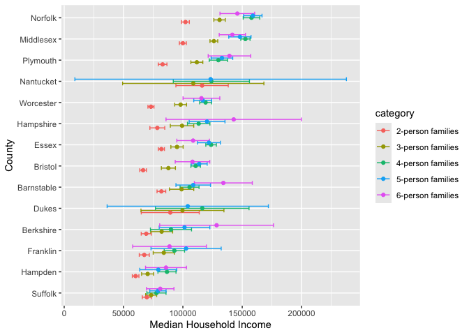
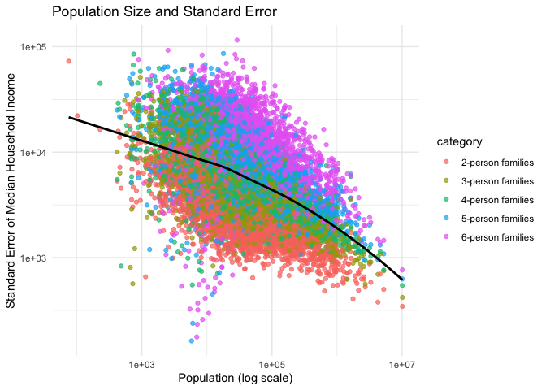
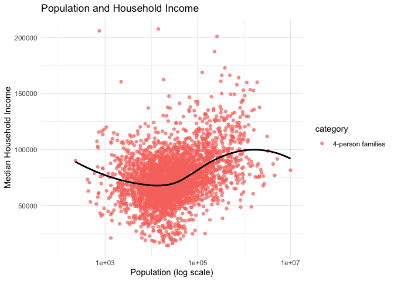

US Income
================
Sparsh Gupta
2025-04-01

- [Grading Rubric](#grading-rubric)
  - [Individual](#individual)
  - [Submission](#submission)
- [Setup](#setup)
  - [**q1** Load the population data from c06; simply replace
    `filename_pop`
    below.](#q1-load-the-population-data-from-c06-simply-replace-filename_pop-below)
  - [**q2** Obtain median income data from the Census
    Bureau:](#q2-obtain-median-income-data-from-the-census-bureau)
  - [**q3** Tidy the `df_income` dataset by completing the code below.
    Pivot and rename the columns to arrive at the column names
    `id, geographic_area_name, category, income_estimate, income_moe`.](#q3-tidy-the-df_income-dataset-by-completing-the-code-below-pivot-and-rename-the-columns-to-arrive-at-the-column-names-id-geographic_area_name-category-income_estimate-income_moe)
  - [**q4** Convert the margin of error to standard error. Additionally,
    compute a 99% confidence interval on income, and normalize the
    standard error to `income_CV = income_SE / income_estimate`. Provide
    these columns with the names
    `income_SE, income_lo, income_hi, income_CV`.](#q4-convert-the-margin-of-error-to-standard-error-additionally-compute-a-99-confidence-interval-on-income-and-normalize-the-standard-error-to-income_cv--income_se--income_estimate-provide-these-columns-with-the-names-income_se-income_lo-income_hi-income_cv)
  - [**q5** Join `df_q4` and `df_pop`.](#q5-join-df_q4-and-df_pop)
- [Analysis](#analysis)
  - [**q6** Study the following graph, making sure to note what you can
    *and can’t* conclude based on the estimates and confidence
    intervals. Document your observations below and answer the
    questions.](#q6-study-the-following-graph-making-sure-to-note-what-you-can-and-cant-conclude-based-on-the-estimates-and-confidence-intervals-document-your-observations-below-and-answer-the-questions)
  - [**q7** Plot the standard error against population for all counties.
    Create a visual that effectively highlights the trends in the data.
    Answer the questions under *observations*
    below.](#q7-plot-the-standard-error-against-population-for-all-counties-create-a-visual-that-effectively-highlights-the-trends-in-the-data-answer-the-questions-under-observations-below)
- [Going Further](#going-further)
  - [**q8** Pose your own question about the data. Create a
    visualization (or table) here, and document your
    observations.](#q8-pose-your-own-question-about-the-data-create-a-visualization-or-table-here-and-document-your-observations)
- [References](#references)

*Purpose*: We’ve been learning how to quantify uncertainty in estimates
through the exercises; now its time to put those skills to use studying
real data. In this challenge we’ll use concepts like confidence
intervals to help us make sense of census data.

*Reading*: - [Using ACS Estimates and Margin of
Error](https://www.census.gov/data/academy/webinars/2020/calculating-margins-of-error-acs.html)
(Optional, see the PDF on the page) - [Patterns and Causes of
Uncertainty in the American Community
Survey](https://www.sciencedirect.com/science/article/pii/S0143622813002518?casa_token=VddzQ1-spHMAAAAA:FTq92LXgiPVloJUVjnHs8Ma1HwvPigisAYtzfqaGbbRRwoknNq56Y2IzszmGgIGH4JAPzQN0)
(Optional, particularly the *Uncertainty in surveys* section under the
Introduction.)

<!-- include-rubric -->

# Grading Rubric

<!-- -------------------------------------------------- -->

Unlike exercises, **challenges will be graded**. The following rubrics
define how you will be graded, both on an individual and team basis.

## Individual

<!-- ------------------------- -->

| Category | Needs Improvement | Satisfactory |
|----|----|----|
| Effort | Some task **q**’s left unattempted | All task **q**’s attempted |
| Observed | Did not document observations, or observations incorrect | Documented correct observations based on analysis |
| Supported | Some observations not clearly supported by analysis | All observations clearly supported by analysis (table, graph, etc.) |
| Assessed | Observations include claims not supported by the data, or reflect a level of certainty not warranted by the data | Observations are appropriately qualified by the quality & relevance of the data and (in)conclusiveness of the support |
| Specified | Uses the phrase “more data are necessary” without clarification | Any statement that “more data are necessary” specifies which *specific* data are needed to answer what *specific* question |
| Code Styled | Violations of the [style guide](https://style.tidyverse.org/) hinder readability | Code sufficiently close to the [style guide](https://style.tidyverse.org/) |

## Submission

<!-- ------------------------- -->

Make sure to commit both the challenge report (`report.md` file) and
supporting files (`report_files/` folder) when you are done! Then submit
a link to Canvas. **Your Challenge submission is not complete without
all files uploaded to GitHub.**

# Setup

<!-- ----------------------------------------------------------------------- -->

``` r
library(tidyverse)
```

    ## ── Attaching core tidyverse packages ──────────────────────── tidyverse 2.0.0 ──
    ## ✔ dplyr     1.1.4     ✔ readr     2.1.5
    ## ✔ forcats   1.0.0     ✔ stringr   1.5.1
    ## ✔ ggplot2   3.5.1     ✔ tibble    3.2.1
    ## ✔ lubridate 1.9.4     ✔ tidyr     1.3.1
    ## ✔ purrr     1.0.2     
    ## ── Conflicts ────────────────────────────────────────── tidyverse_conflicts() ──
    ## ✖ dplyr::filter() masks stats::filter()
    ## ✖ dplyr::lag()    masks stats::lag()
    ## ℹ Use the conflicted package (<http://conflicted.r-lib.org/>) to force all conflicts to become errors

### **q1** Load the population data from c06; simply replace `filename_pop` below.

``` r
## TODO: Give the filename for your copy of Table B01003
filename_pop <- "./data/ACSDT5Y2018.B01003-Data.csv"

## NOTE: No need to edit
df_pop <-
  read_csv(
    filename_pop,
    skip = 1,
  ) %>% 
  rename(
    population_estimate = `Estimate!!Total`
  )
```

    ## New names:
    ## Rows: 3220 Columns: 5
    ## ── Column specification
    ## ──────────────────────────────────────────────────────── Delimiter: "," chr
    ## (3): Geography, Geographic Area Name, Margin of Error!!Total dbl (1):
    ## Estimate!!Total lgl (1): ...5
    ## ℹ Use `spec()` to retrieve the full column specification for this data. ℹ
    ## Specify the column types or set `show_col_types = FALSE` to quiet this message.
    ## • `` -> `...5`

``` r
df_pop
```

    ## # A tibble: 3,220 × 5
    ##    Geography   `Geographic Area Name` population_estimate Margin of Error!!Tot…¹
    ##    <chr>       <chr>                                <dbl> <chr>                 
    ##  1 0500000US0… Autauga County, Alaba…               55200 *****                 
    ##  2 0500000US0… Baldwin County, Alaba…              208107 *****                 
    ##  3 0500000US0… Barbour County, Alaba…               25782 *****                 
    ##  4 0500000US0… Bibb County, Alabama                 22527 *****                 
    ##  5 0500000US0… Blount County, Alabama               57645 *****                 
    ##  6 0500000US0… Bullock County, Alaba…               10352 *****                 
    ##  7 0500000US0… Butler County, Alabama               20025 *****                 
    ##  8 0500000US0… Calhoun County, Alaba…              115098 *****                 
    ##  9 0500000US0… Chambers County, Alab…               33826 *****                 
    ## 10 0500000US0… Cherokee County, Alab…               25853 *****                 
    ## # ℹ 3,210 more rows
    ## # ℹ abbreviated name: ¹​`Margin of Error!!Total`
    ## # ℹ 1 more variable: ...5 <lgl>

You might wonder why the `Margin of Error` in the population estimates
is listed as `*****`. From the [documentation (PDF
link)](https://www.google.com/url?sa=t&rct=j&q=&esrc=s&source=web&cd=&cad=rja&uact=8&ved=2ahUKEwj81Omy16TrAhXsguAKHTzKDQEQFjABegQIBxAB&url=https%3A%2F%2Fwww2.census.gov%2Fprograms-surveys%2Facs%2Ftech_docs%2Faccuracy%2FMultiyearACSAccuracyofData2018.pdf%3F&usg=AOvVaw2TOrVuBDlkDI2gde6ugce_)
for the ACS:

> If the margin of error is displayed as ‘\*\*\*\*\*’ (five asterisks),
> the estimate has been controlled to be equal to a fixed value and so
> it has no sampling error. A standard error of zero should be used for
> these controlled estimates when completing calculations, such as those
> in the following section.

This means that for cases listed as `*****` the US Census Bureau
recommends treating the margin of error (and thus standard error) as
zero.

### **q2** Obtain median income data from the Census Bureau:

- `Filter > Topics > Income and Poverty > Income and Poverty`
- `Filter > Geography > County > All counties in United States`
- Look for `Median Income in the Past 12 Months` (Table S1903)
- Download the 2018 5-year ACS estimates; save to your `data` folder and
  add the filename below.

``` r
## TODO: Give the filename for your copy of Table S1903
filename_income <- "./data/ACSST5Y2018.S1903-Data.csv"

## NOTE: No need to edit
df_income <-
  read_csv(filename_income, skip = 1)
```

    ## New names:
    ## • `` -> `...243`

    ## Warning: One or more parsing issues, call `problems()` on your data frame for details,
    ## e.g.:
    ##   dat <- vroom(...)
    ##   problems(dat)

    ## Rows: 3220 Columns: 243
    ## ── Column specification ────────────────────────────────────────────────────────
    ## Delimiter: ","
    ## chr  (66): Geography, Geographic Area Name, Estimate!!Median income (dollars...
    ## dbl (176): Estimate!!Number!!HOUSEHOLD INCOME BY RACE AND HISPANIC OR LATINO...
    ## lgl   (1): ...243
    ## 
    ## ℹ Use `spec()` to retrieve the full column specification for this data.
    ## ℹ Specify the column types or set `show_col_types = FALSE` to quiet this message.

``` r
df_income
```

    ## # A tibble: 3,220 × 243
    ##    Geography      `Geographic Area Name`   Estimate!!Number!!HOUSEHOLD INCOME …¹
    ##    <chr>          <chr>                                                    <dbl>
    ##  1 0500000US01001 Autauga County, Alabama                                  21115
    ##  2 0500000US01003 Baldwin County, Alabama                                  78622
    ##  3 0500000US01005 Barbour County, Alabama                                   9186
    ##  4 0500000US01007 Bibb County, Alabama                                      6840
    ##  5 0500000US01009 Blount County, Alabama                                   20600
    ##  6 0500000US01011 Bullock County, Alabama                                   3609
    ##  7 0500000US01013 Butler County, Alabama                                    6708
    ##  8 0500000US01015 Calhoun County, Alabama                                  45033
    ##  9 0500000US01017 Chambers County, Alabama                                 13516
    ## 10 0500000US01019 Cherokee County, Alabama                                 10606
    ## # ℹ 3,210 more rows
    ## # ℹ abbreviated name:
    ## #   ¹​`Estimate!!Number!!HOUSEHOLD INCOME BY RACE AND HISPANIC OR LATINO ORIGIN OF HOUSEHOLDER!!Households`
    ## # ℹ 240 more variables:
    ## #   `Margin of Error!!Number MOE!!HOUSEHOLD INCOME BY RACE AND HISPANIC OR LATINO ORIGIN OF HOUSEHOLDER!!Households` <dbl>,
    ## #   `Estimate!!Number!!HOUSEHOLD INCOME BY RACE AND HISPANIC OR LATINO ORIGIN OF HOUSEHOLDER!!Households!!One race--!!White` <dbl>,
    ## #   `Margin of Error!!Number MOE!!HOUSEHOLD INCOME BY RACE AND HISPANIC OR LATINO ORIGIN OF HOUSEHOLDER!!Households!!One race--!!White` <dbl>, …

Use the following test to check that you downloaded the correct file:

``` r
## NOTE: No need to edit, use to check you got the right file.
assertthat::assert_that(
  df_income %>%
    filter(Geography == "0500000US01001") %>%
    pull(`Estimate!!Percent Distribution!!FAMILY INCOME BY FAMILY SIZE!!2-person families`)
  == 45.6
)
```

    ## [1] TRUE

``` r
print("Well done!")
```

    ## [1] "Well done!"

This dataset is in desperate need of some *tidying*. To simplify the
task, we’ll start by considering the `\\d-person families` columns
first.

### **q3** Tidy the `df_income` dataset by completing the code below. Pivot and rename the columns to arrive at the column names `id, geographic_area_name, category, income_estimate, income_moe`.

*Hint*: You can do this in a single pivot using the `".value"` argument
and a `names_pattern` using capture groups `"()"`. Remember that you can
use an OR operator `|` in a regex to allow for multiple possibilities in
a capture group, for example `"(Estimate|Margin of Error)"`.

``` r
df_q3 <-
  df_income %>%
  select(
    Geography,
    contains("Geographic"),
    # This will select only the numeric d-person family columns;
    # it will ignore the annotation columns
    contains("median") & matches("\\d-person families") & !contains("Annotation of")
  ) %>%
  mutate(across(contains("median"), as.numeric)) %>%
  ## Pivot the data, rename the columns
  pivot_longer(
    cols = -c(Geography, contains("Geographic")),
    names_to = c("type", "category"),
    names_pattern = "(Estimate|Margin of Error)!!.*!!FAMILY INCOME BY FAMILY SIZE!!(\\d-person families)",
    values_to = "value"
  ) %>%
  pivot_wider(
    names_from = type,
    values_from = value,
    names_prefix = "income_"
  ) %>%
  rename(
    geographic_area_name = contains("Geographic"),
    income_estimate = contains("income_Estimate"),
    income_moe = contains("income_Margin")
  )
```

    ## Warning: There were 8 warnings in `mutate()`.
    ## The first warning was:
    ## ℹ In argument: `across(contains("median"), as.numeric)`.
    ## Caused by warning:
    ## ! NAs introduced by coercion
    ## ℹ Run `dplyr::last_dplyr_warnings()` to see the 7 remaining warnings.

``` r
df_q3
```

    ## # A tibble: 16,100 × 5
    ##    Geography      geographic_area_name    category    income_estimate income_moe
    ##    <chr>          <chr>                   <chr>                 <dbl>      <dbl>
    ##  1 0500000US01001 Autauga County, Alabama 2-person f…           64947       6663
    ##  2 0500000US01001 Autauga County, Alabama 3-person f…           80172      14181
    ##  3 0500000US01001 Autauga County, Alabama 4-person f…           85455      10692
    ##  4 0500000US01001 Autauga County, Alabama 5-person f…           88601      20739
    ##  5 0500000US01001 Autauga County, Alabama 6-person f…          103787      12387
    ##  6 0500000US01003 Baldwin County, Alabama 2-person f…           63975       2297
    ##  7 0500000US01003 Baldwin County, Alabama 3-person f…           79390       8851
    ##  8 0500000US01003 Baldwin County, Alabama 4-person f…           88458       5199
    ##  9 0500000US01003 Baldwin County, Alabama 5-person f…           91259       7011
    ## 10 0500000US01003 Baldwin County, Alabama 6-person f…           69609      23175
    ## # ℹ 16,090 more rows

Use the following tests to check your work:

``` r
## NOTE: No need to edit
assertthat::assert_that(setequal(
  names(df_q3),
  c("Geography", "geographic_area_name", "category", "income_estimate", "income_moe")
))
```

    ## [1] TRUE

``` r
assertthat::assert_that(
  df_q3 %>%
    filter(Geography == "0500000US01001", category == "2-person families") %>%
    pull(income_moe)
  == 6663
)
```

    ## [1] TRUE

``` r
print("Nice!")
```

    ## [1] "Nice!"

The data gives finite values for the Margin of Error, which is closely
related to the Standard Error. The Census Bureau documentation gives the
following relationship between Margin of Error and Standard Error:

$$\text{MOE} = 1.645 \times \text{SE}.$$

### **q4** Convert the margin of error to standard error. Additionally, compute a 99% confidence interval on income, and normalize the standard error to `income_CV = income_SE / income_estimate`. Provide these columns with the names `income_SE, income_lo, income_hi, income_CV`.

``` r
df_q4 <- df_q3 %>%
  mutate(
    income_SE = income_moe / 1.645,  
    income_lo = income_estimate - 2.576 * income_SE, 
    income_hi = income_estimate + 2.576 * income_SE, 
    income_CV = income_SE / income_estimate
  )

df_q4
```

    ## # A tibble: 16,100 × 9
    ##    Geography  geographic_area_name category income_estimate income_moe income_SE
    ##    <chr>      <chr>                <chr>              <dbl>      <dbl>     <dbl>
    ##  1 0500000US… Autauga County, Ala… 2-perso…           64947       6663     4050.
    ##  2 0500000US… Autauga County, Ala… 3-perso…           80172      14181     8621.
    ##  3 0500000US… Autauga County, Ala… 4-perso…           85455      10692     6500.
    ##  4 0500000US… Autauga County, Ala… 5-perso…           88601      20739    12607.
    ##  5 0500000US… Autauga County, Ala… 6-perso…          103787      12387     7530.
    ##  6 0500000US… Baldwin County, Ala… 2-perso…           63975       2297     1396.
    ##  7 0500000US… Baldwin County, Ala… 3-perso…           79390       8851     5381.
    ##  8 0500000US… Baldwin County, Ala… 4-perso…           88458       5199     3160.
    ##  9 0500000US… Baldwin County, Ala… 5-perso…           91259       7011     4262.
    ## 10 0500000US… Baldwin County, Ala… 6-perso…           69609      23175    14088.
    ## # ℹ 16,090 more rows
    ## # ℹ 3 more variables: income_lo <dbl>, income_hi <dbl>, income_CV <dbl>

Use the following tests to check your work:

``` r
## NOTE: No need to edit
assertthat::assert_that(setequal(
  names(df_q4),
  c("Geography", "geographic_area_name", "category", "income_estimate", "income_moe",
    "income_SE", "income_lo", "income_hi", "income_CV")
))
```

    ## [1] TRUE

``` r
assertthat::assert_that(
  abs(
    df_q4 %>%
    filter(Geography == "0500000US01001", category == "2-person families") %>%
    pull(income_SE) - 4050.456
  ) / 4050.456 < 1e-3
)
```

    ## [1] TRUE

``` r
assertthat::assert_that(
  abs(
    df_q4 %>%
    filter(Geography == "0500000US01001", category == "2-person families") %>%
    pull(income_lo) - 54513.72
  ) / 54513.72 < 1e-3
)
```

    ## [1] TRUE

``` r
assertthat::assert_that(
  abs(
    df_q4 %>%
    filter(Geography == "0500000US01001", category == "2-person families") %>%
    pull(income_hi) - 75380.28
  ) / 75380.28 < 1e-3
)
```

    ## [1] TRUE

``` r
assertthat::assert_that(
  abs(
    df_q4 %>%
    filter(Geography == "0500000US01001", category == "2-person families") %>%
    pull(income_CV) - 0.06236556
  ) / 0.06236556 < 1e-3
)
```

    ## [1] TRUE

``` r
print("Nice!")
```

    ## [1] "Nice!"

One last wrangling step: We need to join the two datasets so we can
compare population with income.

### **q5** Join `df_q4` and `df_pop`.

``` r
## TODO: Join df_q4 and df_pop by the appropriate column

df_data <- df_q4 %>%
  inner_join(df_pop, by = "Geography")

df_data
```

    ## # A tibble: 16,100 × 13
    ##    Geography  geographic_area_name category income_estimate income_moe income_SE
    ##    <chr>      <chr>                <chr>              <dbl>      <dbl>     <dbl>
    ##  1 0500000US… Autauga County, Ala… 2-perso…           64947       6663     4050.
    ##  2 0500000US… Autauga County, Ala… 3-perso…           80172      14181     8621.
    ##  3 0500000US… Autauga County, Ala… 4-perso…           85455      10692     6500.
    ##  4 0500000US… Autauga County, Ala… 5-perso…           88601      20739    12607.
    ##  5 0500000US… Autauga County, Ala… 6-perso…          103787      12387     7530.
    ##  6 0500000US… Baldwin County, Ala… 2-perso…           63975       2297     1396.
    ##  7 0500000US… Baldwin County, Ala… 3-perso…           79390       8851     5381.
    ##  8 0500000US… Baldwin County, Ala… 4-perso…           88458       5199     3160.
    ##  9 0500000US… Baldwin County, Ala… 5-perso…           91259       7011     4262.
    ## 10 0500000US… Baldwin County, Ala… 6-perso…           69609      23175    14088.
    ## # ℹ 16,090 more rows
    ## # ℹ 7 more variables: income_lo <dbl>, income_hi <dbl>, income_CV <dbl>,
    ## #   `Geographic Area Name` <chr>, population_estimate <dbl>,
    ## #   `Margin of Error!!Total` <chr>, ...5 <lgl>

# Analysis

<!-- ----------------------------------------------------------------------- -->

We now have both estimates and confidence intervals for
`\\d-person families`. Now we can compare cases with quantified
uncertainties: Let’s practice!

### **q6** Study the following graph, making sure to note what you can *and can’t* conclude based on the estimates and confidence intervals. Document your observations below and answer the questions.

``` r
## NOTE: No need to edit; run and inspect
wid <- 0.5

df_data %>%
  filter(str_detect(geographic_area_name, "Massachusetts")) %>%
  mutate(
    county = str_remove(geographic_area_name, " County,.*$"),
    county = fct_reorder(county, income_estimate, .na_rm = TRUE)
  ) %>%

  ggplot(aes(county, income_estimate, color = category)) +
  geom_errorbar(
    aes(ymin = income_lo, ymax = income_hi),
    position = position_dodge(width = wid)
  ) +
  geom_point(position = position_dodge(width = wid)) +

  coord_flip() +
  labs(
    x = "County",
    y = "Median Household Income"
  )
```

    ## Warning: Removed 2 rows containing missing values or values outside the scale range
    ## (`geom_point()`).

<!-- -->

**Observations**:

- Median household incomes vary significantly across Massachusetts
  counties.
- There are noticeable differences between household sizes (2-person,
  3-person, etc.), with larger families generally having higher median
  incomes.
- Can you confidently distinguish between household incomes in Suffolk
  county? Why or why not?
  - The confidence intervals for different household sizes within
    Suffolk County overlap considerably, and so we cannot confidently
    distinguish between their median incomes.
- Which counties have the widest confidence intervals?
  - The counties Dukes and Nantucket have the widest confidence
    intervals, indicating higher uncertainty in their income estimates.

In the next task you’ll investigate the relationship between population
and uncertainty.

### **q7** Plot the standard error against population for all counties. Create a visual that effectively highlights the trends in the data. Answer the questions under *observations* below.

*Hint*: Remember that standard error is a function of *both* variability
(e.g. variance) and sample size.

``` r
df_data %>%
  ggplot(aes(x = population_estimate, y = income_SE, color = category)) +
  geom_point(alpha = 0.7) +  
  geom_smooth(method = "loess", se = FALSE, color = "black") +  
  scale_x_log10() +
  scale_y_log10() +
  labs(
    x = "Population (log scale)",
    y = "Standard Error of Median Household Income",
    title = "Population Size and Standard Error",
  ) +
  theme_minimal()
```

    ## `geom_smooth()` using formula = 'y ~ x'

    ## Warning: Removed 814 rows containing non-finite outside the scale range
    ## (`stat_smooth()`).

    ## Warning: Removed 814 rows containing missing values or values outside the scale range
    ## (`geom_point()`).

<!-- -->

**Observations**:

- What *overall* trend do you see between `SE` and population? Why might
  this trend exist?
  - The plot shows a negative correlation between SE and population.
  - As population increases, the standard error decreases, meaning that
    larger counties have more precise income estimates.
  - This trend probably exists because larger sample sizes reduce
    uncertainty in statistical estimates. A county with a higher
    population provides more data points, making the income estimates
    more reliable. This is based on the assumption that the Census
    bureau gathers a larger sample from counties with larger
    populations. However, this reasoning could be invalid if the Census
    bureau used a fixed size of samples for each county, and in that
    case, there possibly might be a different explanation for this
    trend.
- What does this *overall* trend tell you about the relative ease of
  studying small vs large counties?
  - Small counties are harder to study because they exhibit greater
    standard errors, meaning their income estimates are less reliable.
    Here, we need to account for greater uncertainty when analyzing
    income statistics.
  - Larger counties are easier to study as they have smaller SEs,
    leading to more precise estimates.

# Going Further

<!-- ----------------------------------------------------------------------- -->

Now it’s your turn! You have income data for every county in the United
States: Pose your own question and try to answer it with the data.

### **q8** Pose your own question about the data. Create a visualization (or table) here, and document your observations.

``` r
df_data %>%
  filter(str_detect(category, "4-person families")) %>%
  ggplot(aes(x = population_estimate, y = income_estimate, color = category)) +
  geom_point(alpha = 0.7) + 
  scale_x_log10() +
  geom_smooth(method = "loess", se = FALSE, color = "black") +  
  labs(
    x = "Population (log scale)",
    y = "Median Household Income",
    title = "Population and Household Income",
  ) +
  theme_minimal()
```

    ## `geom_smooth()` using formula = 'y ~ x'

    ## Warning: Removed 47 rows containing non-finite outside the scale range
    ## (`stat_smooth()`).

    ## Warning: Removed 47 rows containing missing values or values outside the scale range
    ## (`geom_point()`).

<!-- -->

**Observations**:

- The black trend line indicates a nonlinear relationship—median income
  initially decreases with population, then rises, and finally slightly
  declines again at the highest population levels

- There’s more spread in income among mid-population to high-population
  areas, with some reaching above \$200,000 and others well below
  \$100,000.

- The lowest point on the trend line occurs around populations of 10^4
  to 10^5, indicating that these mid-sized areas tend to have slightly
  lower median incomes.

- A significant cluster of points lies between median incomes of
  \$50,000–\$100,000 and populations between 10^4 and 10^6, suggesting
  that’s where most 4-person families reside.

- A few outliers have extremely high incomes (above \$200,000), however,
  there is no discernable trend within these outliers.

# References

<!-- ----------------------------------------------------------------------- -->

\[1\] Spielman SE, Folch DC, Nagle NN (2014) Patterns and causes of
uncertainty in the American Community Survey. Applied Geography 46:
147–157. <pmid:25404783>
[link](https://www.sciencedirect.com/science/article/pii/S0143622813002518?casa_token=VddzQ1-spHMAAAAA:FTq92LXgiPVloJUVjnHs8Ma1HwvPigisAYtzfqaGbbRRwoknNqZ6Y2IzszmGgIGH4JAPzQN0)

``` r
## IGNORE - for c09 presentation
df_data_project <- df_data %>%
  select("Geography", "geographic_area_name", "category", "income_estimate", "income_moe", "population_estimate")
write.csv(df_data_project, "~/Desktop/c09_income.csv", row.names = FALSE)
```
