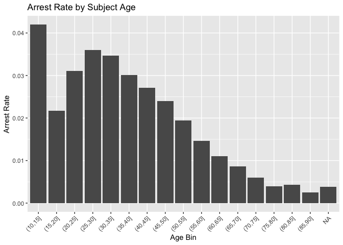
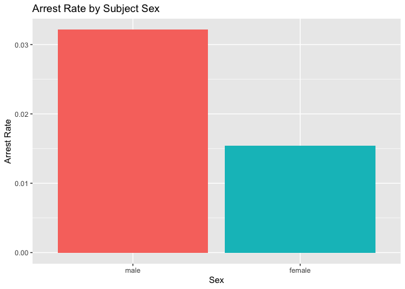
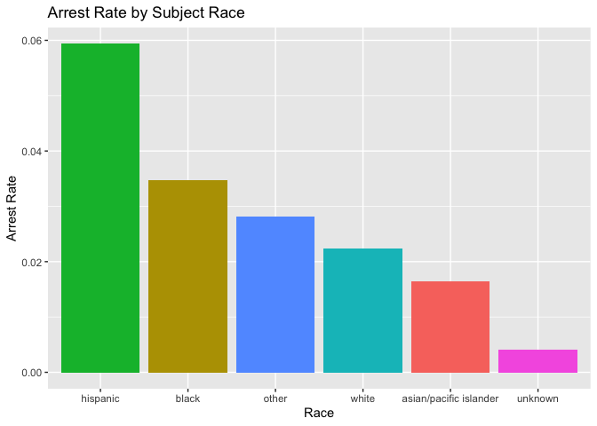

Massachusetts Highway Stops
================
Sparsh Gupta
2025-04-11

- [Grading Rubric](#grading-rubric)
  - [Individual](#individual)
  - [Submission](#submission)
- [Setup](#setup)
  - [**q1** Go to the Stanford Open Policing Project page and download
    the Massachusetts State Police records in `Rds` format. Move the
    data to your `data` folder and match the `filename` to load the
    data.](#q1-go-to-the-stanford-open-policing-project-page-and-download-the-massachusetts-state-police-records-in-rds-format-move-the-data-to-your-data-folder-and-match-the-filename-to-load-the-data)
- [EDA](#eda)
  - [**q2** Do your “first checks” on the dataset. What are the basic
    facts about this
    dataset?](#q2-do-your-first-checks-on-the-dataset-what-are-the-basic-facts-about-this-dataset)
  - [**q3** Check the set of factor levels for `subject_race` and
    `raw_Race`. What do you note about overlap / difference between the
    two
    sets?](#q3-check-the-set-of-factor-levels-for-subject_race-and-raw_race-what-do-you-note-about-overlap--difference-between-the-two-sets)
  - [**q4** Check whether `subject_race` and `raw_Race` match for a
    large fraction of cases. Which of the two hypotheses above is most
    likely, based on your
    results?](#q4-check-whether-subject_race-and-raw_race-match-for-a-large-fraction-of-cases-which-of-the-two-hypotheses-above-is-most-likely-based-on-your-results)
  - [Vis](#vis)
    - [**q5** Compare the *arrest rate*—the fraction of total cases in
      which the subject was arrested—across different factors. Create as
      many visuals (or tables) as you need, but make sure to check the
      trends across all of the `subject` variables. Answer the questions
      under *observations*
      below.](#q5-compare-the-arrest-ratethe-fraction-of-total-cases-in-which-the-subject-was-arrestedacross-different-factors-create-as-many-visuals-or-tables-as-you-need-but-make-sure-to-check-the-trends-across-all-of-the-subject-variables-answer-the-questions-under-observations-below)
- [Modeling](#modeling)
  - [**q6** Run the following code and interpret the regression
    coefficients. Answer the the questions under *observations*
    below.](#q6-run-the-following-code-and-interpret-the-regression-coefficients-answer-the-the-questions-under-observations-below)
  - [**q7** Re-fit the logistic regression from q6 setting `"white"` as
    the reference level for `subject_race`. Interpret the the model
    terms and answer the questions
    below.](#q7-re-fit-the-logistic-regression-from-q6-setting-white-as-the-reference-level-for-subject_race-interpret-the-the-model-terms-and-answer-the-questions-below)
  - [**q8** Re-fit the model using a factor indicating the presence of
    contraband in the subject’s vehicle. Answer the questions under
    *observations*
    below.](#q8-re-fit-the-model-using-a-factor-indicating-the-presence-of-contraband-in-the-subjects-vehicle-answer-the-questions-under-observations-below)
  - [**q9** Go deeper: Pose at least one more question about the data
    and fit at least one more model in support of answering that
    question.](#q9-go-deeper-pose-at-least-one-more-question-about-the-data-and-fit-at-least-one-more-model-in-support-of-answering-that-question)
  - [Further Reading](#further-reading)

*Purpose*: In this last challenge we’ll focus on using logistic
regression to study a large, complicated dataset. Interpreting the
results of a model can be challenging—both in terms of the statistics
and the real-world reasoning—so we’ll get some practice in this
challenge.

<!-- include-rubric -->

# Grading Rubric

<!-- -------------------------------------------------- -->

Unlike exercises, **challenges will be graded**. The following rubrics
define how you will be graded, both on an individual and team basis.

## Individual

<!-- ------------------------- -->

| Category | Needs Improvement | Satisfactory |
|----|----|----|
| Effort | Some task **q**’s left unattempted | All task **q**’s attempted |
| Observed | Did not document observations, or observations incorrect | Documented correct observations based on analysis |
| Supported | Some observations not clearly supported by analysis | All observations clearly supported by analysis (table, graph, etc.) |
| Assessed | Observations include claims not supported by the data, or reflect a level of certainty not warranted by the data | Observations are appropriately qualified by the quality & relevance of the data and (in)conclusiveness of the support |
| Specified | Uses the phrase “more data are necessary” without clarification | Any statement that “more data are necessary” specifies which *specific* data are needed to answer what *specific* question |
| Code Styled | Violations of the [style guide](https://style.tidyverse.org/) hinder readability | Code sufficiently close to the [style guide](https://style.tidyverse.org/) |

## Submission

<!-- ------------------------- -->

Make sure to commit both the challenge report (`report.md` file) and
supporting files (`report_files/` folder) when you are done! Then submit
a link to Canvas. **Your Challenge submission is not complete without
all files uploaded to GitHub.**

*Background*: We’ll study data from the [Stanford Open Policing
Project](https://openpolicing.stanford.edu/data/), specifically their
dataset on Massachusetts State Patrol police stops.

``` r
library(tidyverse)
```

    ## ── Attaching core tidyverse packages ──────────────────────── tidyverse 2.0.0 ──
    ## ✔ dplyr     1.1.4     ✔ readr     2.1.5
    ## ✔ forcats   1.0.0     ✔ stringr   1.5.1
    ## ✔ ggplot2   3.5.1     ✔ tibble    3.2.1
    ## ✔ lubridate 1.9.4     ✔ tidyr     1.3.1
    ## ✔ purrr     1.0.2     
    ## ── Conflicts ────────────────────────────────────────── tidyverse_conflicts() ──
    ## ✖ dplyr::filter() masks stats::filter()
    ## ✖ dplyr::lag()    masks stats::lag()
    ## ℹ Use the conflicted package (<http://conflicted.r-lib.org/>) to force all conflicts to become errors

``` r
library(broom)
```

# Setup

<!-- -------------------------------------------------- -->

### **q1** Go to the [Stanford Open Policing Project](https://openpolicing.stanford.edu/data/) page and download the Massachusetts State Police records in `Rds` format. Move the data to your `data` folder and match the `filename` to load the data.

*Note*: An `Rds` file is an R-specific file format. The function
`readRDS` will read these files.

``` r
## TODO: Download the data, move to your data folder, and load it
filename <- "./data/yg821jf8611_ma_statewide_2020_04_01.rds"
df_data <- readRDS(filename)
```

# EDA

<!-- -------------------------------------------------- -->

### **q2** Do your “first checks” on the dataset. What are the basic facts about this dataset?

``` r
summary(df_data)
```

    ##  raw_row_number          date              location         county_name       
    ##  Length:3416238     Min.   :2007-01-01   Length:3416238     Length:3416238    
    ##  Class :character   1st Qu.:2009-04-22   Class :character   Class :character  
    ##  Mode  :character   Median :2011-07-08   Mode  :character   Mode  :character  
    ##                     Mean   :2011-07-16                                        
    ##                     3rd Qu.:2013-08-27                                        
    ##                     Max.   :2015-12-31                                        
    ##                                                                               
    ##   subject_age                     subject_race     subject_sex     
    ##  Min.   :10.00    asian/pacific islander: 166842   male  :2362238  
    ##  1st Qu.:25.00    black                 : 351610   female:1038377  
    ##  Median :34.00    hispanic              : 338317   NA's  :  15623  
    ##  Mean   :36.47    white                 :2529780                   
    ##  3rd Qu.:46.00    other                 :  11008                   
    ##  Max.   :94.00    unknown               :  17017                   
    ##  NA's   :158006   NA's                  :   1664                   
    ##          type         arrest_made     citation_issued warning_issued 
    ##  pedestrian:      0   Mode :logical   Mode :logical   Mode :logical  
    ##  vehicular :3416238   FALSE:3323303   FALSE:1244039   FALSE:2269244  
    ##                       TRUE :92019     TRUE :2171283   TRUE :1146078  
    ##                       NA's :916       NA's :916       NA's :916      
    ##                                                                      
    ##                                                                      
    ##                                                                      
    ##      outcome        contraband_found contraband_drugs contraband_weapons
    ##  warning :1146078   Mode :logical    Mode :logical    Mode :logical     
    ##  citation:2171283   FALSE:28256      FALSE:36296      FALSE:53237       
    ##  summons :      0   TRUE :27474      TRUE :19434      TRUE :2493        
    ##  arrest  :  92019   NA's :3360508    NA's :3360508    NA's :3360508     
    ##  NA's    :   6858                                                       
    ##                                                                         
    ##                                                                         
    ##  contraband_alcohol contraband_other frisk_performed search_conducted
    ##  Mode :logical      Mode :logical    Mode :logical   Mode :logical   
    ##  FALSE:3400070      FALSE:51708      FALSE:51029     FALSE:3360508   
    ##  TRUE :16168        TRUE :4022       TRUE :3602      TRUE :55730     
    ##                     NA's :3360508    NA's :3361607                   
    ##                                                                      
    ##                                                                      
    ##                                                                      
    ##          search_basis     reason_for_stop    vehicle_type      
    ##  k9            :      0   Length:3416238     Length:3416238    
    ##  plain view    :      0   Class :character   Class :character  
    ##  consent       :   6903   Mode  :character   Mode  :character  
    ##  probable cause:  25898                                        
    ##  other         :  18228                                        
    ##  NA's          :3365209                                        
    ##                                                                
    ##  vehicle_registration_state   raw_Race        
    ##  MA     :3053713            Length:3416238    
    ##  CT     :  82906            Class :character  
    ##  NY     :  69059            Mode  :character  
    ##  NH     :  51514                              
    ##  RI     :  39375                              
    ##  (Other): 109857                              
    ##  NA's   :   9814

``` r
head(df_data)
```

    ## # A tibble: 6 × 24
    ##   raw_row_number date       location      county_name   subject_age subject_race
    ##   <chr>          <date>     <chr>         <chr>               <int> <fct>       
    ## 1 1              2007-06-06 MIDDLEBOROUGH Plymouth Cou…          33 white       
    ## 2 2              2007-06-07 SEEKONK       Bristol Coun…          36 white       
    ## 3 3              2007-06-07 MEDFORD       Middlesex Co…          56 white       
    ## 4 4              2007-06-07 MEDFORD       Middlesex Co…          37 white       
    ## 5 5              2007-06-07 EVERETT       Middlesex Co…          22 hispanic    
    ## 6 6              2007-06-07 MEDFORD       Middlesex Co…          34 white       
    ## # ℹ 18 more variables: subject_sex <fct>, type <fct>, arrest_made <lgl>,
    ## #   citation_issued <lgl>, warning_issued <lgl>, outcome <fct>,
    ## #   contraband_found <lgl>, contraband_drugs <lgl>, contraband_weapons <lgl>,
    ## #   contraband_alcohol <lgl>, contraband_other <lgl>, frisk_performed <lgl>,
    ## #   search_conducted <lgl>, search_basis <fct>, reason_for_stop <chr>,
    ## #   vehicle_type <chr>, vehicle_registration_state <fct>, raw_Race <chr>

**Observations**:

- Around 3.42 million total observations

<!-- -->

- Data covers dates from January 1, 2007 to December 31, 2015

- Subject age ranges from 10 to 94 years old, with a median age of 34

- Most vehicles registered in Massachusetts (~3.05 million), followed by
  CT, NY, NH, RI

- Many variables have significant missing data, especially those related
  to contraband and searches

Note that we have both a `subject_race` and `race_Raw` column. There are
a few possibilities as to what `race_Raw` represents:

- `race_Raw` could be the race of the police officer in the stop
- `race_Raw` could be an unprocessed version of `subject_race`

Let’s try to distinguish between these two possibilities.

### **q3** Check the set of factor levels for `subject_race` and `raw_Race`. What do you note about overlap / difference between the two sets?

``` r
## TODO: Determine the factor levels for subject_race and raw_Race
sort(unique(df_data$subject_race))
```

    ## [1] asian/pacific islander black                  hispanic              
    ## [4] white                  other                  unknown               
    ## Levels: asian/pacific islander black hispanic white other unknown

``` r
sort(unique(df_data$raw_Race))
```

    ## [1] "A"                                            
    ## [2] "American Indian or Alaskan Native"            
    ## [3] "Asian or Pacific Islander"                    
    ## [4] "Black"                                        
    ## [5] "Hispanic"                                     
    ## [6] "Middle Eastern or East Indian (South Asian)"  
    ## [7] "None - for no operator present citations only"
    ## [8] "White"

**Observations**:

- What are the unique values for `subject_race`?

  - asian/pacific islander

  <!-- -->

  - black

  - hispanic

  - white

  - other

  - unknown

- What are the unique values for `raw_Race`?

  - A

  <!-- -->

  - American Indian or Alaskan Native

  - Asian or Pacific Islander

  - Black

  - Hispanic

  - Middle Eastern or East Indian (South Asian)

  - None - for no operator present citations only

  - White

- What is the overlap between the two sets?

  - Black

  <!-- -->

  - Hispanic

  - White

  - Asian or Pacific Islander (maps to asian/pacific islander with
    standardization)

- What is the difference between the two sets?

  - `subject_race` uses standardized and grouped categories with
    consistent formatting

  <!-- -->

  - `raw_Race` includes more granular or specific labels (e.g. “Middle
    Eastern or East Indian (South Asian)”, “American Indian or Alaskan
    Native”)

  - `raw_Race` includes administrative categories like “None - for no
    operator present citations only”

  - `raw_Race` has abbreviations like “A” that don’t appear in
    `subject_race`

### **q4** Check whether `subject_race` and `raw_Race` match for a large fraction of cases. Which of the two hypotheses above is most likely, based on your results?

*Note*: Just to be clear, I’m *not* asking you to do a *statistical*
hypothesis test.

``` r
## TODO: Devise your own way to test the hypothesis posed above.
df_data <- df_data %>%
  mutate(
    raw_Race_simplified = case_when(
      raw_Race %in% c("Asian or Pacific Islander") ~ "asian/pacific islander",
      raw_Race %in% c("Black") ~ "black",
      raw_Race %in% c("Hispanic") ~ "hispanic",
      raw_Race %in% c("White") ~ "white",
      raw_Race %in% c("American Indian or Alaskan Native", 
                      "Middle Eastern or East Indian (South Asian)") ~ "other",
      raw_Race %in% c("None - for no operator present citations only", "A") ~ "unknown",
      TRUE ~ NA_character_
    )
  )

df_data <- df_data %>%
  mutate(race_match = subject_race == raw_Race_simplified)

race_match_summary <- df_data %>%
  count(race_match) %>%
  mutate(percentage = n / sum(n) * 100)

print(race_match_summary)
```

    ## # A tibble: 3 × 3
    ##   race_match       n percentage
    ##   <lgl>        <int>      <dbl>
    ## 1 FALSE        64552     1.89  
    ## 2 TRUE       3350022    98.1   
    ## 3 NA            1664     0.0487

**Observations**

Between the two hypotheses:

- `race_Raw` could be the race of the police officer in the stop
- `race_Raw` could be an unprocessed version of `subject_race`

which is most plausible, based on your results?

- The most plausible explanation is that `raw_Race` is an unprocessed
  version of `subject_race`.

<!-- -->

- Over 98% of the entries in the dataset show a match between
  `subject_race` and a simplified version of `raw_Race`. This strong
  agreement would not be expected if `raw_Race` referred to the race of
  the police officer, since we would then expect the values to differ
  from `subject_race` in most cases.

- Additionally, the content of `raw_Race` includes fine-grained racial
  or ethnic categories that appear to be standardized or grouped in
  `subject_race`, further supporting the idea that `subject_race` is a
  cleaned or normalized version of `raw_Race`.

## Vis

<!-- ------------------------- -->

### **q5** Compare the *arrest rate*—the fraction of total cases in which the subject was arrested—across different factors. Create as many visuals (or tables) as you need, but make sure to check the trends across all of the `subject` variables. Answer the questions under *observations* below.

(Note: Create as many chunks and visuals as you need)

``` r
df_data <- df_data %>%
  mutate(arrest_made = ifelse(is.na(arrest_made), FALSE, arrest_made))

df_data %>%
  filter(!is.na(subject_age)) %>%
  mutate(age_bin = cut(subject_age, breaks = seq(10, 90, by = 5))) %>%
  group_by(age_bin) %>%
  summarize(arrest_rate = mean(arrest_made)) %>%
  ggplot(aes(x = age_bin, y = arrest_rate)) +
  geom_col() +
  labs(title = "Arrest Rate by Subject Age", x = "Age Bin", y = "Arrest Rate") +
  theme(axis.text.x = element_text(angle = 45, hjust = 1))
```

<!-- -->

``` r
df_data %>%
  filter(!is.na(subject_sex)) %>%
  group_by(subject_sex) %>%
  summarize(arrest_rate = mean(arrest_made)) %>%
  ggplot(aes(x = subject_sex, y = arrest_rate, fill = subject_sex)) +
  geom_col() +
  labs(title = "Arrest Rate by Subject Sex", x = "Sex", y = "Arrest Rate") +
  theme(legend.position = "none")
```

<!-- -->

``` r
df_data %>%
  filter(!is.na(subject_race)) %>%
  group_by(subject_race) %>%
  summarize(arrest_rate = mean(arrest_made)) %>%
  ggplot(aes(x = reorder(subject_race, -arrest_rate), y = arrest_rate, fill = subject_race)) +
  geom_col() +
  labs(title = "Arrest Rate by Subject Race", x = "Race", y = "Arrest Rate") +
  theme(legend.position = "none")
```

<!-- -->

**Observations**:

- How does `arrest_rate` tend to vary with `subject_age`?

  - Arrest rates are highest among the youngest drivers (especially ages
    10–15 and 25–35), then steadily decline with age.

  <!-- -->

  - Drivers over 60 have much lower arrest rates.

- How does `arrest_rate` tend to vary with `subject_sex`?

  - Males have a significantly higher arrest rate than females.

- How does `arrest_rate` tend to vary with `subject_race`?

  - Hispanic and Black individuals have the highest arrest rates.

  <!-- -->

  - White and Asian/Pacific Islander individuals have notably lower
    arrest rates.

# Modeling

<!-- -------------------------------------------------- -->

We’re going to use a model to study the relationship between `subject`
factors and arrest rate, but first we need to understand a bit more
about *dummy variables*

### **q6** Run the following code and interpret the regression coefficients. Answer the the questions under *observations* below.

``` r
## NOTE: No need to edit; inspect the estimated model terms.
fit_q6 <-
  glm(
    formula = arrest_made ~ subject_age + subject_race + subject_sex,
    data = df_data %>%
      filter(
        !is.na(arrest_made),
        subject_race %in% c("white", "black", "hispanic")
      ),
    family = "binomial"
  )

fit_q6 %>% tidy()
```

    ## # A tibble: 5 × 5
    ##   term                 estimate std.error statistic   p.value
    ##   <chr>                   <dbl>     <dbl>     <dbl>     <dbl>
    ## 1 (Intercept)           -2.67    0.0132      -202.  0        
    ## 2 subject_age           -0.0142  0.000280     -50.5 0        
    ## 3 subject_racehispanic   0.513   0.0119        43.3 0        
    ## 4 subject_racewhite     -0.380   0.0103       -37.0 3.16e-299
    ## 5 subject_sexfemale     -0.755   0.00910      -83.0 0

**Observations**:

- Which `subject_race` levels are included in fitting the model?
  - The model includes white, black, and hispanic individuals (others
    were filtered out).
- Which `subject_race` levels have terms in the model?
  - Only hispanic and white have coefficients; black is the reference
    category (baseline group), so it does not appear as a separate term.

You should find that each factor in the model has a level *missing* in
its set of terms. This is because R represents factors against a
*reference level*: The model treats one factor level as “default”, and
each factor model term represents a change from that “default” behavior.
For instance, the model above treats `subject_sex==male` as the
reference level, so the `subject_sexfemale` term represents the *change
in probability* of arrest due to a person being female (rather than
male).

The this reference level approach to coding factors is necessary for
[technical
reasons](https://www.andrew.cmu.edu/user/achoulde/94842/lectures/lecture10/lecture10-94842.html#why-is-one-of-the-levels-missing-in-the-regression),
but it complicates interpreting the model results. For instance; if we
want to compare two levels, neither of which are the reference level, we
have to consider the difference in their model coefficients. But if we
want to compare all levels against one “baseline” level, then we can
relevel the data to facilitate this comparison.

By default `glm` uses the first factor level present as the reference
level. Therefore we can use
`mutate(factor = fct_relevel(factor, "desired_level"))` to set our
`"desired_level"` as the reference factor.

### **q7** Re-fit the logistic regression from q6 setting `"white"` as the reference level for `subject_race`. Interpret the the model terms and answer the questions below.

``` r
## TODO: Re-fit the logistic regression, but set "white" as the reference
## level for subject_race
library(forcats)

fit_q7 <- glm(
  formula = arrest_made ~ subject_age + subject_race + subject_sex,
  data = df_data %>%
    filter(
      !is.na(arrest_made),
      subject_race %in% c("white", "black", "hispanic")
    ) %>%
    mutate(subject_race = fct_relevel(subject_race, "white")),
  family = "binomial"
)


fit_q7 %>% tidy()
```

    ## # A tibble: 5 × 5
    ##   term                 estimate std.error statistic   p.value
    ##   <chr>                   <dbl>     <dbl>     <dbl>     <dbl>
    ## 1 (Intercept)           -3.05    0.0109      -279.  0        
    ## 2 subject_age           -0.0142  0.000280     -50.5 0        
    ## 3 subject_raceblack      0.380   0.0103        37.0 3.16e-299
    ## 4 subject_racehispanic   0.893   0.00859      104.  0        
    ## 5 subject_sexfemale     -0.755   0.00910      -83.0 0

**Observations**:

- Which `subject_race` level has the highest probability of being
  arrested, according to this model? Which has the lowest probability?
  - Hispanic individuals have the highest probability of being arrested;
    white individuals have the lowest, according to the model.
- What could explain this difference in probabilities of arrest across
  race? List **multiple** possibilities.
  - Possible explanations include systemic bias in policing, differences
    in stop circumstances, differences in geographic or vehicle-related
    factors, or unobserved variables like behavior during the stop.
- Look at the set of variables in the dataset; do any of the columns
  relate to a potential explanation you listed?
  - The dataset includes columns like reason_for_stop, vehicle_type,
    search_conducted, and contraband_found, which could help explain
    differences in arrest rates across racial groups.

One way we can explain differential arrest rates is to include some
measure indicating the presence of an arrestable offense. We’ll do this
in a particular way in the next task.

### **q8** Re-fit the model using a factor indicating the presence of contraband in the subject’s vehicle. Answer the questions under *observations* below.

``` r
## TODO: Repeat the modeling above, but control for whether contraband was found
## during the police stop
fit_q8 <- glm(
  formula = arrest_made ~ subject_age + subject_race + subject_sex + contraband_found,
  data = df_data %>%
    filter(
      !is.na(arrest_made),
      subject_race %in% c("white", "black", "hispanic")
    ) %>%
    mutate(
      subject_race = fct_relevel(subject_race, "white"),
      contraband_found = ifelse(is.na(contraband_found), FALSE, contraband_found)
    ),
  family = "binomial"
)

fit_q8 %>% tidy()
```

    ## # A tibble: 6 × 5
    ##   term                 estimate std.error statistic   p.value
    ##   <chr>                   <dbl>     <dbl>     <dbl>     <dbl>
    ## 1 (Intercept)           -3.31    0.0113      -293.  0        
    ## 2 subject_age           -0.0101  0.000284     -35.4 1.22e-274
    ## 3 subject_raceblack      0.351   0.0105        33.3 1.13e-242
    ## 4 subject_racehispanic   0.880   0.00885       99.5 0        
    ## 5 subject_sexfemale     -0.694   0.00921      -75.4 0        
    ## 6 contraband_foundTRUE   3.02    0.0135       223.  0

**Observations**:

- How does controlling for found contraband affect the `subject_race`
  terms in the model?
  - Controlling for contraband slightly reduces the coefficients for
    both black and hispanic subjects, but substantial racial disparities
    in arrest probability remain.
- What does the *finding of contraband* tell us about the stop? What
  does it *not* tell us about the stop?
  - Finding contraband indicates that an arrestable offense may have
    occurred, which helps explain some arrests.
  - It does not tell us whether the search itself was justified or
    conducted fairly, nor does it explain why some groups are searched
    more often than others.

### **q9** Go deeper: Pose at least one more question about the data and fit at least one more model in support of answering that question.

**Question:** Are racial disparities in arrests primarily driven by
differences in search rates rather than differences in actual behavior
or contraband possession?

``` r
fit_q9 <- glm(
  formula = search_conducted ~ subject_age + subject_race + subject_sex,
  data = df_data %>%
    filter(
      !is.na(search_conducted),
      subject_race %in% c("white", "black", "hispanic")
    ) %>%
    mutate(subject_race = fct_relevel(subject_race, "white")),
  family = "binomial"
)

fit_q9 %>% tidy()
```

    ## # A tibble: 5 × 5
    ##   term                 estimate std.error statistic   p.value
    ##   <chr>                   <dbl>     <dbl>     <dbl>     <dbl>
    ## 1 (Intercept)           -2.76    0.0141      -195.  0        
    ## 2 subject_age           -0.0379  0.000406     -93.2 0        
    ## 3 subject_raceblack      0.460   0.0124        37.1 2.50e-301
    ## 4 subject_racehispanic   0.685   0.0113        60.8 0        
    ## 5 subject_sexfemale     -0.729   0.0114       -63.8 0

**Observations**:

- Black and Hispanic individuals are significantly more likely to be
  searched than white individuals, even after controlling for age and
  sex.
- Hispanic subjects have the highest predicted likelihood of being
  searched, followed by Black subjects.

<!-- -->

- Younger people are more likely to be searched than older individuals.

- Females are less likely to be searched than males.

- These disparities in search rates may contribute to higher arrest
  rates among certain racial groups, even if contraband possession is
  similar.

## Further Reading

<!-- -------------------------------------------------- -->

- Stanford Open Policing Project
  [findings](https://openpolicing.stanford.edu/findings/).
